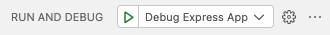

# Debugging in VS Code

The setup here mirrors the [`webpack:dev:server`](https://github.com/bbc/simorgh/blob/2944b327aac6fa22a8b5474d24e48fb631728431/package.json#L65) `package.json` script. You run it in the debug tab choosing 'Debug Express App'.

You can debug the NextJS app by choosing 'Debug Next.js: server-side'; this command has been adapted from the docs [here](https://nextjs.org/docs/pages/building-your-application/configuring/debugging#debugging-with-vs-code)
