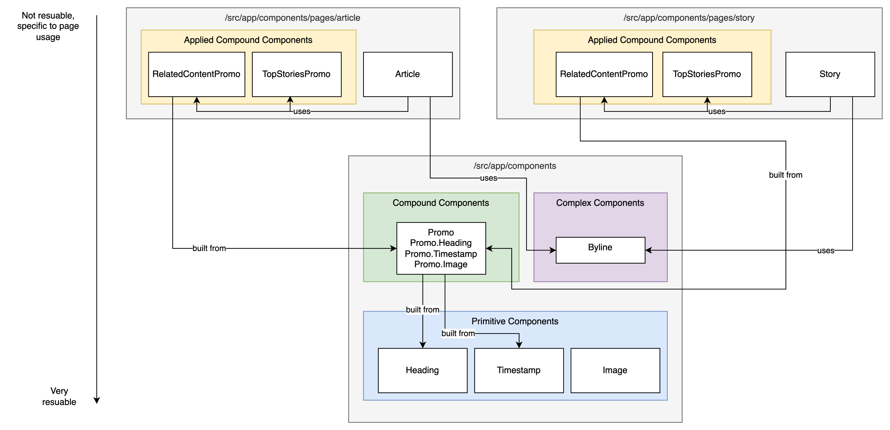
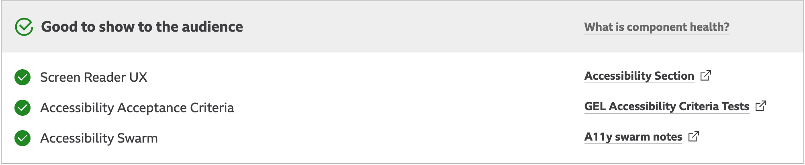

import { Meta, Markdown } from '@storybook/blocks';

<Meta title="Coding Standards/React Components" />

# Coding standards: React Components

## Avoid JSX props spreading

### Why?

This enhances readability of code by being more explicit about what props are received by the component.

### How?

❌

```jsx
<Promo {...props} />
```

✅

```jsx
<Promo title={promoTitle} image={promoImage} />
```

## Prefer use of custom Hooks over the higher order component pattern

### Why?

[React Hooks](https://reactjs.org/docs/hooks-intro.html) were introduced in React 16.8. They enable use of state and other React features without having to write a class. [Custom Hooks](https://reactjs.org/docs/hooks-custom.html) enables us to extract component logic into reusable functions.

Previously, patterns like higher order components allowed us to share logic across components but their creation and use is cumbersome and makes code harder to follow. It also contributes to the “wrapper hell” of components you might see when using React DevTools.

### How?

If possible, refactor [these higher order components](https://github.com/bbc/simorgh/tree/latest/src/app/containers/PageHandlers) into Hooks or deprecate their use going forward.

If logic or behaviour can be shared across components, then consider writing a [custom Hook](https://reactjs.org/docs/hooks-custom.html).

### Resources

* [React Docs: Hooks at a Glance](https://reactjs.org/docs/hooks-overview.html)
* [React FAQs: Do Hooks replace render props and higher-order components?](https://reactjs.org/docs/hooks-faq.html#do-hooks-replace-render-props-and-higher-order-components)

## Write function components rather than class components

### Why?

After the introduction of [React Hooks](https://reactjs.org/docs/hooks-overview.html), writing function components has become the standard way of writing React components in modern applications and is even mentioned in the [React documentation](https://reactjs.org/docs/hooks-faq.html#should-i-use-hooks-classes-or-a-mix-of-both).

Benefits of function components over class components include:

* Less boilerplate
* Easier to understand
* Easier to reuse stateful logic between components with React Hooks

### How?

❌

```jsx
class Footer extends React.Component {
  render() {
    return <footer>© {new Date().getFullYear()} BBC</footer>;
  }
}
```

✅

```jsx
const Footer = () => <footer>©{new Date().getFullYear()} BBC</footer>;
```

## Avoid adding spacings and a restricted width to components

### Why?

It’s easier to reuse components without spacings e.g. margins and restricted because they are able to fill any space fully without leaving gaps or overflowing a container. It eliminates the need to override styles to remove spacings and restricted widths or to add props to the component e.g. `fullWidth` when the component dimensions do not suit the use case.

### How?

Ensure the component does not contain any spacing styles around the component and that the component itself can fill the width of any container.

The spacing and width of component should be determined by the parent element (or container element) of the component. In this example the container is a grid:

❌

```jsx
const StyledPromosContainer = styled.div`
  display: grid;
  grid-template-columns: repeat(3, 1fr);
  grid-gap: 0.5rem;
`;

const StyledPromo = styled.div`
  margin: 1rem; // spacing around component
  width: 300px; // restricted width
  background-color: #f5f5f5;
`;

const Main = () => (
  <main>
    <StyledPromosContainer>
      <StyledPromo style={{ width: '100%', margin: 0 }} />
      <StyledPromo style={{ width: '100%', margin: 0 }} />
      <StyledPromo style={{ width: '100%', margin: 0 }} />
    </StyledPromosContainer>
  </main>
);
```

✅

```jsx
const StyledPromosContainer = styled.div`
  display: grid;
  grid-template-columns: repeat(3, 1fr);
  grid-gap: 1rem;
`;

const StyledPromo = styled.div`
  background-color: #f5f5f5;
`;

const Main = () => (
  <main>
    <StyledPromosContainer>
      <StyledPromo />
      <StyledPromo />
      <StyledPromo />
    </StyledPromosContainer>
  </main>
);
```

## Keep styled components in a separate file

### Why?

Component files are easier to reason about when you separate the presentation from the content and behaviour aspects of a component. With this separation of concerns, there is less cognitive load when it comes to updating the content or behaviour of a component because everything concerning the presentation is out of sight and mind in a separate file.

### How?

Put styled components in a file with the same filename as the component but with `.styles` before the `.tsx` file extension. For example, `index.styles.jsx`. Then reference the styled components in the component file.

❌

```jsx
const StyledWrapper = styled.div`
  display: grid;
  grid-template-columns: repeat(3, 1fr);
  grid-gap: 1rem;
`;

const StyledMain = styled.main`
  grid-column: auto / span 2;
`;

const StyledSupplementaryContent = styled.div`
  background-color: #f5f5f5;
`;

const Page = () => (
  <StyledWrapper>
    <StyledMain />
    <StyledSupplementaryContent />
  </StyledWrapper>
);
```

✅

```jsx
const { StyledWrapper, StyledMain, StyledSupplementaryContent } from './index.styled'

const Page = () => (
  <StyledWrapper>
    <StyledMain />
    <StyledSupplementaryContent />
  </StyledWrapper>
)
```

## Primitive Components, Compound Components and Complex Components

For our frontend components, we focus on reuse at root of our React Component tree. We have a set of ‘Primitive Components’ that are the building blocks of other components higher up the tree.

### Primitive Components

These components will have few if any internal dependencies and focus on applying common concerns universal everywhere such as typography.

In a high level example below we define some building blocks of a promo including `Title` , `Timestamp` and `Image` .

### Compound Components

These components apply the ‘[Compound Component Pattern](https://kentcdodds.com/blog/compound-components-with-react-hooks)’ to create a ‘Compound Component’ that can be used to implement a particular user experience across different page types.

In our worked example we create a `Promo` that allows customised versions of `Title` , `Timestamp` and `Image` to be used in different ways depending on the use case.

### Complex Components

These components use Primitive components to build a reusable component that isn’t suitable to be implemented as a Compound Component. It needs limited or no customisation for usages on different pages. A Complex Component could later be converted to Compound Component if it needed significant customisation that differed across Page Types.

In our example below we have a `Byline` component used on both Article and Story Pages with no customisation at all.

### Applied Compound Components

At this level we take a ‘Compound Component’ and build an ‘Applied Compound Component’ that is very specific to the page’s use case. At this level we can apply specific styling and add in additional functionality completely bespoke to that page’s requirements; we are:

* Reusing the functionality common across all pages from the Primitive Components
* Reusing the functionality common to all usages of a particular user experience from the Compound Component
* Applying customisations for the specific usage at the page level; we are free to make changes here without worrying about reuse

In our example these are `RelatedContentPromo` and `TopStoriesPromo` respectively. Differences to the Promos on the respective page types are applied in these Components and they are co-located with the Page.

### Bringing it Together

Below is the full worked example. The example shows our Article and Story pages implementing their own Applied Components for Related Content and Top Stories. They also use a Complex Component to implement a Byline at the top of the article, it needs no customisation between the page types. The Promo Compound Component and Byline Complex Component use the Primitive Components to present a resuable component for use across page types.



### Summary

In the past we built highly configurable, reusable components that required large amounts of props to be ‘drilled’ into components to allow them to work on a particular page. An example of this was the [StoryPromo](https://github.com/bbc/simorgh/blob/d025086b41fb8753ec1a3992977bef5b013410b7/src/app/containers/StoryPromo/index.jsx#L126) component. With these highly configurable components the complexity grew and grew as they were reused in more places.

In the new approach we make simple highly reusable primitive components with few customisation options, we create CompoundComponents to guide reuse through a set of child components and then we apply these for our specific page types, pushing specialisation to the top of the component hierarchy.

## Component Locations

### Legacy Components

Before looking to apply our component standards we have a huge body of components that will not meet the existing standards to provide a ‘clean slate’. These have been moved to a legacy location in the following manner:

<Markdown>
{`
| Previous Location  | New Location              | Remarks                                                                                                                                                                                                                        |
| ------------------ | ------------------------- | ------------------------------------------------------------------------------------------------------------------------------------------------------------------------------------------------------------------------------ |
| src/app/legacy     | src/app/legacy/psammead   | These are components that used be maintained in a separate component library: https://github.com/bbc/psammead                                                                                                                  |
| src/app/components | src/app/legacy/components | These are react components vaguely constituting components from the [component-container](https://medium.com/@dan_abramov/smart-and-dumb-components-7ca2f9a7c7d0) pattern - we have decided not to follow this pattern anymore |
| src/app/containers | src/app/legacy/containers | These are react components vaguely constituting containers from the [component-container](https://medium.com/@dan_abramov/smart-and-dumb-components-7ca2f9a7c7d0) pattern - we have decided not to follow this pattern anymore |
`}
</Markdown>


N.B. As referred to above we are moving away from the [component-container](https://medium.com/@dan_abramov/smart-and-dumb-components-7ca2f9a7c7d0) pattern as engineers historically struggled to differentiate between the two and the distinction offered little from a maintenance perspective

### Standardised Components

With a clear understanding of where our ‘legacy’ components can be found we now make space for our ‘standardised’ components that meet our new standards agreed in this doc.

Firstly, we will move pages into the now empty components directory:
`/src/app/pages` → `/src/app/components/pages`

And all components meeting our standards will from now on will be maintained in the following directories:

<Markdown>
{`
| Component Types                 | Location                    |
| ------------------------------- | --------------------------- |
| Primitive, Compound, Complex    | src/app/components      |
| Applied Compound, Page Specific | src/app/components/pages |
`}
</Markdown>

### Applying Standardisation

Where possible we want to apply standardisation as an ‘opportunistic refactor’. As we look to use existing components to deliver a feature, we commit to rebuilding those components or porting them across applying new best practices. Through doing this we gradually improve the consistency and standards of our components rather then embarking on a unrealistic drive to rebuild all components to a new standard. The necessity of delivering a feature keeps scope under control while the standards maintain the quality of the code for that feature.

Since it will be not be feasible to migrate all components to the new standard, sometimes we will need to make a judgment call, on a case-by-case basis, about when or whether to apply standardisation.

As a rule of thumb, the following criteria could be used to help make this decision:

* *The component requires modification as part of current feature delivery*

  If the component needs to be updated anyway to accommodate for new functionality, then we can opportunistically refactor it now to make it more understandable for future maintainers.

* *The component is small and simple*

  The work involved in standardising the component is likely to be minimal, and so, makes it a good candidate for migration.

* *The component is a visual component*

  Our current guidelines are largely focussed on visual rather than non-visual components, e.g. component health focuses on UX and accessibility, which is more applicable for components which are displayed in Storybook.

* *The component is likely to require modification in future development work*

  When a component has a high likelihood of change as part of future feature development, we gain more value by bringing it up to standard. Time spent by engineers comprehending how a legacy component works, is time which could potentially be saved if the component was brought up to standard.

**Here is a helpful guide on how to [Migrate Legacy Components](https://latest--5d28eb3fe163f6002046d6fa.chromatic.com/?path=/story/coding-standards-migrating-legacy-components--page).**

## Typescript for Frontend Components

* Our visual components should be written in TypeScript to clearly document each component’s API and get the benefits of compile-time type checking between components.

* Types should be co-located with the component that uses them; they should only be maintained in a shared location where they are used by multiple visual components
  * Here is an example of shared types in our BFF application: https://github.com/bbc/fabl-modules/tree/master/modules/application/simorgh-bff/src/models
  * We can locate any shared types in `src/app/components/models`

* Types should be as strict as possible
  * Avoid use of the `any` type and try and define a more specific type

* Where a prop has a fixed set of options use a [`union type`](https://camchenry.com/blog/typescript-union-type) to restrict the prop to those fixed options

* Typescript components do not use directory aliases because previously this has been used as a band-aid on poor file organisation. In theory, by relying on the principle of code colocation and not nesting files mutliple directory levels deep, then import paths should not be so difficult to maintain and not reach for code in far away places.

## Component Health

All components should have a component health visualisation in Storybook similar to [webcore](https://paper.dropbox.com/doc/What-is-component-health--BfG_Ski_wr7eLwwMF_aQZlIAAg-2qI1jQCZhKoaGVX4TVlCf?noDesktopRedirect=1)’s implementation:



Component Health should include:

* Link to screen reader UX
* Accessibility acceptance criteria
* Accessibility swarm document
* Whether the component has ‘right-to-left’ support

All linked docs must be secure and not publicly editable

## Readme

All components should have a readme that includes

* A plain text description of what the component does
* API docs describing the component’s props
* A11y notes: explaination of implmentation details specific to a11y requirements
* Usage examples including RTL
* List any third party dependencies in use
* An explanation of any unusual/unintuitive implementation decisions required to work around an external bug (e.g. browser bug) or to deliver quickly to a deadline
