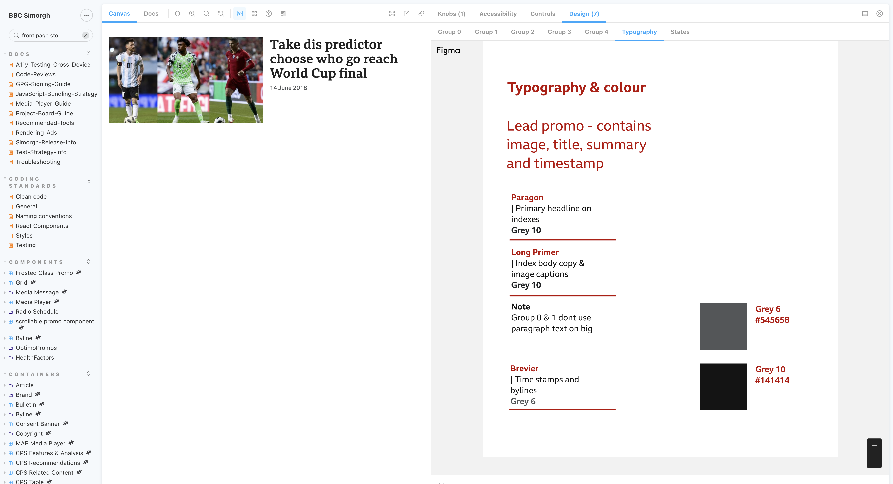

# Coding standards: storybook

## What is storybook

Storybook is a library developed and maintained by [chromatic](https://www.chromatic.com/?utm_source=storybook_website&utm_medium=link&utm_campaign=storybook). Storybook is a frontend workshop for building UI components and pages in isolation. More information about Storybook can be found [here](https://storybook.js.org/docs/react/get-started/why-storybook).
The World Service team adopted Storybook to share components with team members without access to Simorgh locally (e.g. UX, BA, etc...). Furthermore, we use Storybook for a11y swarm components that cannot be deployed to test/live environments.
The latest update of our Storybook included the Docs addon which allows previewing documentation in Storybook. Thus, storybook has recently become our main entry point to Simorgh's documentation.

## Storybook Tutorial

### Introduction - Essentials

Storybook finds story files to render using glob patterns. The glob patterns can be found in `.storybook/main.js`:

```jsx
stories: [
    '../docs/**/*.stories.mdx',
    '../src/app/legacy/components/**/*.stories.@(t|j)sx',
    '../src/app/legacy/containers/**/*.stories.@(t|j)sx',
    '../src/app/components/**/*.stories.@(t|j)sx',
    '../src/app/pages/**/*.stories.@(t|j)sx',
    './DocsDecorator/**/*.stories.@(t|j)sx',
    './SidebarLabel/**/*.stories.@(t|j)sx',
],
```

For any of our stories or documentation to correctly display in storybook we must ensure that the folder where they are stored is pointed by any of the above path glob patterns.

### How to add documentation

Make sure that the place where you store your documentation is pointed by any of the glob patterns in `.storybook/main.js`.
Create a `README.md` and a `.stories.mdx` file, writing the documentation in normal markdown in the README file. Once you have the documentation file ready, add these lines at the top of the .stories.mdx file:

NB: Your documentation should follow markdown format. Guidelines on markdown can be found [here](https://www.markdownguide.org/basic-syntax/).

```jsx
import { Meta } from '@storybook/addon-docs';
import README from './README.md';

//Title follows the path structure where the documentation needs to be stored. More about this is explained in later sections
<Meta title="Coding Standards/Storybook" />;

// This will render the contents of the markdown file
<README />;
```

The above code will allow Storybook to import the markdown you wrote below the `Meta` tag and display it into a story documentation.

### Creating a Basic component's story

To create a story for one of your components, co-locate a file called `index.stories.tsx` where your component's entry point (index.tsx/jsx) is located.
Inside this folder import your component and do a default export of the object as showed below:

```jsx
import MyComponent from '.';

export default {
  // Title follows the path structure where the story needs to be stored. More about this is explained in later sections
  title: 'myComponent',
  // the component you want to display.
  component: MyComponent,
};
```

### Creating story for a component with variants

If your component behaves differently depending on props passed to it, you can create more variants. You will be able to see all of these variants in the component's story.

```jsx
// Same as above but we will need React
import React from 'react';
import MyComponent from '.';

export default {
  title: 'myComponent',
  component: MyComponent,
};

// Export an arrow function with the variants of your components
export const Variant1 = () => <MyComponent prop1={variant1} />;

// The name declaration of this function will also be the name that storybook will give to this variant
export const Variant2 = () => <MyComponent prop1={variant2} />;
```

### How to add component's documentation

You must first co-locate documentation to your component in storybook by placing a readme file in the same location as the index.stories.tsx file.

Make use of [markdown](https://www.markdownguide.org/) when writing your documentation. Once your documentation is ready open the `index.stories.tsx`, import the newly created `README.md` as `md` and pass it down to the default export as shown below:

```jsx
import md from './README.md';

export default {
  title: 'myComponent',
  component: MyComponent,
  parameters: {
    docs: {
      component: {
        // H1 for the documentation
        title: 'My Component',
      },
      // The md file you imported
      page: md,
    },
  },
};
```

### How to add the health factors component

You may update the health factors component of your component by adding the following object to the metadata.json file located within the folder of your component:

```json
{
  "lastUpdated": {
    // add the date you are updating this
    "day": 9,
    "month": "February",
    "year": 2023
  },
  "uxAccessibilityDoc": {
    // swap this value to true if you have added a link to the Documented screen reader UX
    "done": false,
    "reference": {
      // add a link to the Documented screen reader UX
      "url": "",
      "label": "Documented screen reader UX"
    }
  },
  "acceptanceCriteria": {
    "done": false,
    "reference": {
      "url": "add link of resource",
      "label": "Accessibility acceptance criteria"
    }
  },
  "swarm": {
    "done": false,
    "reference": {
      "url": "add link of resource",
      "label": "Accessibility swarm results"
    }
  }
}
```

Once created and modified for your component resources, open the `index.stories.tsx`, import the `metadata.json` as metadata, and add it to the default export object as follows:

```jsx
import metadata from './metadata.json';

export default {
  title: 'components/HealthFactors/HealthFactorsComponent',
  component: myComponent,
  parameters: {
    // The metadata you just imported
    metadata,
  },
};
```

Once this is done, our storybook will take care of adding the health factors component into the documentation tab. To know more of how this works, look at our health factors component [documentation](https://latest--5d28eb3fe163f6002046d6fa.chromatic.com/?path=/docs/components-healthfactors-healthfactorscomponent--health-factors-with-complete-docs).

### How to add Figma previews

Preview example:



To create a sidebar windows with Figma or Zepplin UX designs, add the following `array of objects` to the parameters of your `index.stories.jsx` export:

```jsx
import myComponent

export default {
  title: 'components/HealthFactors/HealthFactorsComponent',
  component: myComponent,
  parameters: {
    design:
    [
      {
        name: 'Screen Reader UX',
        type: 'figma',
        url: 'https://www.figma.com/file/OKzTxh7By6S0jj4U1Tgvug/Promos-(test-file)?node-id=4-471&t=JSEMesVDoLfIbFCm-0',
      },
      {
        name: 'Typography',
        type: 'figma',
        url: 'https://www.figma.com/file/OKzTxh7By6S0jj4U1Tgvug/Promos-(test-file)?node-id=2%3A63&t=rrFhi8jBxJykyAhM-0',
      },
      {
        name: 'States',
        type: 'figma',
        url: 'https://www.figma.com/file/OKzTxh7By6S0jj4U1Tgvug/Promos-(test-file)?node-id=6%3A492&t=rrFhi8jBxJykyAhM-0',
      },
      {
        name: 'Group 0',
        type: 'figma',
        url: 'https://www.figma.com/file/OKzTxh7By6S0jj4U1Tgvug/Promos-(test-file)?node-id=4%3A259&t=rrFhi8jBxJykyAhM-0',
      },
      {
        name: 'Group 1',
        type: 'figma',
        url: 'https://www.figma.com/file/OKzTxh7By6S0jj4U1Tgvug/Promos-(test-file)?node-id=4%3A266&t=rrFhi8jBxJykyAhM-0',
      }
    ],
  },
};
```

To create Figma's URL pointing to specific sections of a design, select the design you want to display and copy the link showed by the browser:


## Stories Standards

### Must have left-to-right & right-to-left variants.

#### Why?

Most of our components must work with both right-to-left and left-to-right typography. We must ensure a visual testing case for both these scenarios.

#### How?

Create and export a left-to-right and right-to-left variant:

```jsx
export const rightToLeft = <div />;
export const leftToRight = <div />;
```

### Must have an english variant.

#### Why?

When creating a story make sure to add at least one english language story for each component's variant. This can be done by modifying the `props` you are passing to your component.

Most of BBC staff in our team only understand English. With these premises it should be clear that writing our story in different languages might
Cause oversight on our part due to the added challenge of translating from a foreign language.
Additionally, as previously stated, we occasionally employ Storybook for accessibility testing of our components. As described in [Assistive technology testing in a foreign language](https://bbc.github.io/accessibility-news-and-you/assistive-technology/assistive-technology-testing-in-a-foreign-language.html),
We should:

> Make every effort when testing with assistive technology (AT), to test with content in a language you can understand.
> Even for an experienced AT user, navigating and reading content in a language that isn't understood would be challenging.

#### How?

Pass english metadata to your component.

### Must follow a specific documentation order when adding Figma links.

The documentation should be added as following:

- Screen Reader UX
- Typography
- States
- Groups 0-5

#### Why?

To keep consistency on the way we store our documentation and give priority to most used documentations first.

#### How?

Order the design array accordingly:

```jsx
[
  {
    name: 'Screen Reader UX',
    type: 'figma',
    url: 'https://www.figma.com/file/OKzTxh7By6S0jj4U1Tgvug/Promos-(test-file)?node-id=4-471&t=JSEMesVDoLfIbFCm-0',
  },
  {
    name: 'Typography',
    type: 'figma',
    url: 'https://www.figma.com/file/OKzTxh7By6S0jj4U1Tgvug/Promos-(test-file)?node-id=2%3A63&t=rrFhi8jBxJykyAhM-0',
  },
  {
    name: 'States',
    type: 'figma',
    url: 'https://www.figma.com/file/OKzTxh7By6S0jj4U1Tgvug/Promos-(test-file)?node-id=6%3A492&t=rrFhi8jBxJykyAhM-0',
  },
  {
    name: 'Group 0',
    type: 'figma',
    url: 'https://www.figma.com/file/OKzTxh7By6S0jj4U1Tgvug/Promos-(test-file)?node-id=4%3A259&t=rrFhi8jBxJykyAhM-0',
  },
  {
    name: 'Group 1',
    type: 'figma',
    url: 'https://www.figma.com/file/OKzTxh7By6S0jj4U1Tgvug/Promos-(test-file)?node-id=4%3A266&t=rrFhi8jBxJykyAhM-0',
  },
];
```

## Folder Structure Standards

Storybook provides us with a simple folder structure. Item's in this structure can be:

- Root (showcased by a text label with the root's name)
- Folders
  
- Groups
  
- Stories
  
- Documentation
  

The folder structure can be controlled via the story title by the following pattern:
`title="root_name/folder_name/name_of_story"`

Additionally. you can have multiple nested folders:
`title="root_name/folder_name/.../folder_name/name_of_story`

e.g.
the file you are currently reading is titled `title="Coding Standards/Storybook"`
Note: in the above example the story is not stored inside a folder.

Both groups and folders can serve as containers. Groups are essentially containers that hold various stories. Folders can contain groups, individual stories, or a combination of both.
At this stage, you should not worry about this difference being Storybook automatically takes care of applying the correct container.

For more information about storybook hierarchy read [naming components and hierarchy](https://storybook.js.org/docs/react/writing-stories/naming-components-and-hierarchy).

### Stories must be inside a root and a folder/Group

You must make sure that each story is inside either a Group or a Folder.

### Why?

In order to enhance component organization and ensure proper functionality of the health factors sidebar labels.

### How?

❌

- story

❌

- root
  - story

✅

- root
  - folder
    - story

### Folders can only contain stories or groups, but not both.

#### Why?

In order to enhance component organization and ensure proper functionality of the health factors sidebar labels.

#### How?

❌

- root
  - folder
    - story
    - folder

✅

- root
  - folder
    - story
    - story

✅

- root
  - folder
    - folder
      - story
      - story
    - folder
      - story

### You must not go deeper than a two levels folder structure.

#### Why?

To prevent excessive nesting and enable correct functioning of health factors sidebar labels.

#### How?

❌

- root
  - folder (level 1)
    - folder (level 2)
      - folder (level 3)
        - story

✅

- root
  - folder (level 1)
    - folder (level 2)
      - story

## Create a storybook checklist

- [ ] Create the index.stories.tsx co-located with the component
- [ ] Create the basic story
- [ ] Add ltr/rtl and english variants
- [ ] Add health factors component metadata
- [ ] Add component's documentation
- [ ] Add Figma links:
  - [ ] Screen reader UX
  - [ ] Typography
  - [ ] States
  - [ ] Groups
- [ ] Praise yourself for the good work d(•́ω•̀)
