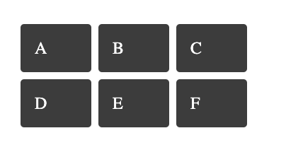

# Coding standards: Styles

## Use Emotion best practices

We use a library called [Emotion](https://emotion.sh/docs/introduction) for writing css styles with JavaScript. It builds on many other CSS-in-JS libraries such as [Styled Components](https://styled-components.com/). It has many benefits such as predictable composition to avoid specificity issues with CSS, abstractions for rendering critical CSS and the ability to colocate styles with components.

It is recommended to look over [Emotion's best practices](https://emotion.sh/docs/best-practices) for recommendations on how to best use this library.

## Use the `css` prop from Emotion with object styles rather than the `styled` API.

When Simorgh and Psammead components were first created, they used Styled Components rather than Emotion for attaching styles to components. When we migrated to Emotion we didn't have to remove use of Styled Component's `styled` API because Emotion provides support for this API. Now that we are building components with new standards there is the opportunity to use [Emotion's primary method to style components](https://emotion.sh/docs/css-prop) - the `css` prop.

Here are some of the benefits of using the `css` prop:

- The Emotion docs state that using the CSS prop is the primary way to style components. This puts us in a good position if Emotion ever decides to drop support for the `styled` API
- With the styled API you're more likely to pollute the DOM with incorrect attributes — a common problem when passing props to styled components to achieve dynamic styles.
- The CSS object is typechecked and provides autocompletion for the CSS property with a description of the property and all possible values e.g. you type `display` and autocomplete gives you a list to choose from `block, flex, inline-flex, grid` etc. TypeScript will also highlight an incorrect value for a property and fail a type check.
- Naming components using the `styled` API (e.g. `StyledWrapper`, `StyledDateTime`, `StyledSpan`) can be burdensome especially when applying small custom styles, such as altering margins or padding. This results in many components which lack the obvious semantic importance you get when using the actual HTML elements. Using the `css` prop avoids having to create and name React components for every element that needs styles.
- Style reuse is easier because you can pass in an array of style objects to the css prop

**NB**
To use Emotion's css prop in TypeScript components we will need to specify the JSX factory at the top of every file. This is because Simorgh currently uses React's old JSX transform. More information can be found here https://emotion.sh/docs/typescript#with-the-old-jsx-transform.

Simorgh cannot currently use the new JSX transform because it is not supported in Opera Mini.

**Usage**

`css` prop with object styles

✅

```jsx
/** @jsx jsx */
import { css, jsx } from '@emotion/react';

const styles = {
  wrapper: css({
    backgroundColor: 'white',
    border: '1px solid #eee',
    borderRadius: '0.5rem',
    padding: '1rem',
  }),

  title: css({
    fontSize: '1.25rem',
  }),
};

const Promo = ({ title, children }) => (
  <div css={styles.wrapper}>
    <h5 css={styles.title}>{title}</h5>
    {children}
  </div>
);
```

Using an array for style reuse or applying one off styles to override default styles

✅

```jsx
const Promo = ({ title, children }) => (
  <div css={styles.wrapper}>
    <h5 css={[styles.title, css({ fontSize: '2rem' })]}>{title}</h5>
    {children}
  </div>
);
```

Getting access to the theme in styles

✅

```jsx
/** @jsx jsx */
import { css, jsx } from '@emotion/react';

const styles = {
  wrapper: css({
    backgroundColor: 'white',
    border: '1px solid #eee',
    borderRadius: '0.5rem',
    padding: '1rem',
  }),
  title: theme =>
    css({
      color: theme.colours.primary,
      fontSize: '1.25rem',
    }),
};

const Promo = ({ title, children }) => (
  <div css={styles.wrapper}>
    <h5 css={styles.title}>{title}</h5>
    {children}
  </div>
);
```

## LTR/RTL design

### When using margins, paddings, borders, use logical CSS properties

By using logical properties, you don’t have to manually write selectors including `[dir="rtl"]` or write CSS-in-JS like:

❌

```js
dir === 'ltr'
  ? `padding-left: ${GEL_SPACING};`
  : `padding-right: ${GEL_SPACING};`;
```

Instead, you can use logical CSS properties for bi-drectional horizontal rules, for example:

✅

```js
padding-inline-start: ${GEL_SPACING};
```

To better understand this, using `padding-inline-start` we are saying, not that we want some padding on the left of content, but that we want some padding at the start of the content, regardless of reading direction.

## Use properties like `grid-gap` for spacings between elements

For correct bi-directional spacing between elements, use properties like `grid-gap` rather than margins or paddings. Properties like `grid-gap` are better suited to bi-directional layouts.

## Do not pass dir to components as a prop for applying LTR/RTL styles

Do not pass `dir` as a prop to components for using in CSS-in-JS styles e.g.

```js
dir === 'ltr'
  ? `padding-right: ${GEL_SPACING};`
  : `padding-left: ${GEL_SPACING};`;
```

This adds unnecessary props and logic to components and styles.

## Do not use the :dir() psuedo class

Currently, browser support for this class is extremely limited.

https://developer.mozilla.org/en-US/docs/Web/CSS/:dir

## Do not use `dir` prop from ServiceContext

We will add `dir` to the theme object. For consistency, get `dir` prop from the theme object with the `useTheme` hook from Emotion. Avoid using this prop for styles. It should only be used for serving different content based on the reading direction.

## Only use `dir` as an attribute on HTML elements with different language content

The `dir` attribute should normally only be present on the `html` element unless we have different language content with a different direction on a page, which we do sometimes e.g. 3rd party podcasts.

## Resources

- https://css-tricks.com/css-logical-properties/
- https://css-tricks.com/bidirectional-horizontal-rules-in-css/

## Responsive styles: Prefer a mobile-first approach to styling

### Why?

A mobile-first approach prioritises developing for the mobile view which is arguably the simplest and most important and often accounts for a higher proportion of user visits. It also prevents desktop-centric development which often leads to complex styles when retrofitting a desktop-centric site to work on mobile devices.

### How?

A mobile-first approach to styling means that styles are applied first to mobile devices. Overrides for larger screens are then added using media queries. This approach favours use of `min-width` media queries over `max-width` media queries.

`min-width` media queries are extremely helpful when it comes to writing responsive styles because it reduces code complexity.

❌

```css
@media (max-width: 37.4375rem) {
  .promo-wrapper {
    display: inline-block;
  }
}

@media (min-width: 37.5rem) and (max-width: 62.9375rem) {
  .promo-wrapper {
    display: flex;
    justify-content: center;
  }
}

@media (min-width: 37.5rem) {
  .promo-wrapper {
    display: flex;
    justify-content: center;
  }
}
```

✅

```css
.promo-wrapper {
  display: inline-block;
}

@media (min-width: 37.5rem) {
  .promo-wrapper {
    display: flex;
    justify-content: space-between;
  }
}

@media (min-width: 63rem) {
  .promo-wrapper {
    justify-content: center;
  }
}
```

### Resources

- https://zellwk.com/blog/how-to-write-mobile-first-css/

## Responsive styles: Use media queries provided in the `theme` object

### Why?

Using the media queries provided in the `theme` object means our breakpoints will be consistent and styles across different viewport widths will be in sync.

### How?

❌

```js
const styles = {
  wrapper: theme =>
    css({
      padding: theme.spacings.HALF,
      '@media (min-width: 40rem)': {
        padding: theme.spacings.FULL,
      },
    }),
};
```

✅

```js
const styles = {
  wrapper: theme =>
    css({
      padding: theme.spacings.HALF,
      [theme.mq.GROUP_3_MIN_WIDTH]: {
        padding: theme.spacings.FULL,
      },
    }),
};
```

## CSS-in-JS: Be aware that passing props to styled components will generate a new class for different arguments

### Why?

It helps to be mindful of how Emotion will generate styles when you pass a styled component a prop use as CSS properties.

Each time you render a component with a different style prop, Emotion generates a new CSS class. If for example, the styled component has a long base64 string for use as a background image, then it would generate 3 huge classes each with the same background:

❌

```js
const Logo = styled.div`
  background: some-huge-base64-string;
  height: ${({ height }) => height}px;
`

<Logo height={100} />
<Logo height={200} />
<Logo height={300} />
```

We should avoid cases like this and generally try to reduce our use of props for styling a component if it will be invoked multiple times on a page with different props.

[CSS Grid Layout](https://developer.mozilla.org/en-US/docs/Web/CSS/grid) is a popular layout mechanism suitable for many use cases, unfortuntately, one of our supported browsers Opera Mini does [not support the API](https://caniuse.com/css-grid). Based on this we have the following guidelines

## CSS Grid can only be used for page layout

Where CSS Grid is used Opera Mini just fall back to the default inline layout so on a desktop this layout in css grid:



Will become:


This fallback behaviour in most cases will provide an acceptable experience for a mobile page layout. Given Opera Mini is a mobile only browser, we can assume that a single column page layout will be acceptable and thus we can use CSS grid to layout pages for other browsers with confidence the fallback on Opera Mini will be acceptable. We still need to test the layout on Opera Mini before going live to ensure we don’t have any unacceptable layout issues.

See for further context: https://jira.dev.bbc.co.uk/browse/WSTEAMA-109

To be clear, CSS Grid should not be used outside of page layout use cases (e.g. to layout a smaller component such as a Promo) as the component will just lay out it’s consitituent parts inline and render incorrectly.

## Don’t implement CSS Grid + Another Layout

One approach to support the use of CSS grid is to ‘[progressively enhance](https://www.smashingmagazine.com/2017/07/enhancing-css-layout-floats-flexbox-grid/#grid-enhancements)’ and use `@supports(display: grid)` . In this approach we could make one implementation using css grid and wrap it in `supports` feature query and then implement the layout again in a layout supported by Opera Mini such as Flexbox. This approach can be advocated if a feature’s support is coming soon to a browser so the implementation is only temporary - we see no prospect of Opera Mini supporting CSS Grid anytime soon however.

With this in mind we discourage creating paralell layout implementations it is better to just implement the layout once using an approach compatible with Opera Mini and all other browsers.

## Don’t use Psammead-Grid

Historically we have used the `[psammead-grid](https://github.com/bbc/simorgh/tree/latest/src/app/legacy/psammead-grid)` [component](https://github.com/bbc/simorgh/tree/latest/src/app/legacy/psammead-grid) to implement a grid-layout in Simorgh. This component supports a grid layout that works on all our supported browsers including Opera Mini. We have decided to move away from this for a few reasons:

- It’s API has proved confusing for engineers to follow as opposed to using standard layout implementations such as flex and grid
- It produces quite a lot of CSS increasing our page weight
- It was overused for layout in places where other layouts are more appropriate

Instead of using Psammead-Grid, native layout implementations should be used.
