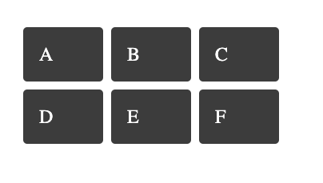
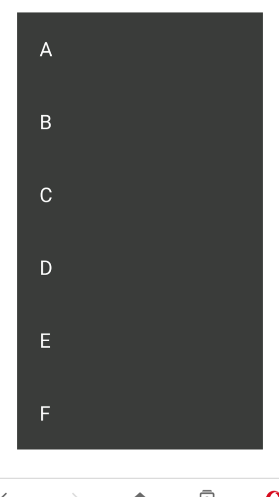

import { Meta } from '@storybook/addon-docs/blocks';

<Meta title="Coding Standards/Styles" />

# Coding standards: Styles

## Use SCSS Modules, not Emotion, for new styling work

Simorgh is progressively migrating its styling foundation from [Emotion](https://emotion.sh/docs/introduction) (CSS-in-JS, `ThemeProvider`) to **SCSS Modules + CSS custom properties** (`ThemeProviderSCSSModules`). Both approaches co-exist in the codebase during the migration, but:

- **All new component styling must use SCSS Modules.** Do not add new Emotion `css` prop or `styled` usage.
- **When you modify an existing Emotion-styled component, migrate it to SCSS Modules as part of that change.**

### How to style a component

Co-locate an `index.module.scss` file next to the component, import it as a `styles` object, and apply classes via `className`:

✅

```scss
// index.module.scss
@use '@scss/themeTokens' as theme;

.promoBox {
  position: relative;
  background-color: theme.$palette-white;
  padding: #{theme.$spacings-double};

  // Dark UI override
  :global([data-is-dark-ui='true']) & {
    background-color: theme.$palette-grey-7;
  }
}

.link {
  @include theme.fontSizes-gel-font-size(pica);
  @include theme.fontVariants-gel-font-variant('serif-bold');
  color: theme.$palette-grey-8;

  &:visited {
    color: theme.$palette-grey-6;
  }
}
```

```tsx
// index.tsx
import styles from './index.module.scss';

const Promo = ({ href, title }: PromoProps) => (
  <div className={styles.promoBox}>
    <a className={styles.link} href={href}>
      {title}
    </a>
  </div>
);
```

❌

```jsx
// Do not add new Emotion styling
const styles = {
  wrapper: css({
    backgroundColor: 'white',
    padding: '1rem',
  }),
};

const Promo = ({ title, children }) => (
  <div css={styles.wrapper}>{children}</div>
);
```

## Use theme tokens instead of hard-coded values

Design tokens (palette, spacing, font sizes/variants, media queries) are exposed as SCSS variables and mixins via `@scss/themeTokens`, which forwards from the shared files in `src/app/components/ThemeProviderSCSSModules/`. Always import and use these rather than hard-coding colours, spacings, font values or breakpoints.

✅

```scss
@use '@scss/themeTokens' as theme;

.label {
  @include theme.fontSizes-gel-font-size(brevier);
  @include theme.fontVariants-gel-font-variant('sans-regular');
  color: theme.$palette-shadow;
  padding: 0 #{theme.$spacings-double};

  @media #{theme.$mediaQueries-group-4-min-width} {
    padding: 0;
  }
}
```

❌

```scss
.label {
  font-size: 14px;
  color: #4c4c4c;
  padding: 0 16px;

  @media (min-width: 63em) {
    padding: 0;
  }
}
```

Service-specific brand/theme values (e.g. brand colours, font families, font scripts) are set as **CSS custom properties on `:root`** by each service's theme module (see `ThemeProviderSCSSModules/themes/<service>/`). Access these through the SCSS mixins provided by `themeTokens`, such as `theme.fontVariants-gel-font-variant('sans-regular')` and `theme.fontSizes-gel-font-size(pica)`, which resolve to the correct custom properties (with fallbacks) for the active service.

## Handling dark UI

Use the `:global([data-is-dark-ui='true']) &` selector inside a component's `.module.scss` to override styles for dark UI, rather than branching in JavaScript/TypeScript:

✅

```scss
.title {
  color: theme.$palette-grey-10;

  :global([data-is-dark-ui='true']) & {
    color: theme.$palette-ghost;
  }
}
```

## Handling Opera Mini fallbacks

[CSS Grid Layout](https://developer.mozilla.org/en-US/docs/Web/CSS/grid) is a popular layout mechanism suitable for many use cases, unfortunately, one of our supported browsers Opera Mini does [not support the API](https://caniuse.com/css-grid). Based on this we have the following guidelines.

### CSS Grid can only be used for page layout

Where CSS Grid is used Opera Mini just falls back to the default inline layout, so on a desktop this layout in CSS grid:



Will become:



This fallback behaviour in most cases will provide an acceptable experience for a mobile page layout. Given Opera Mini is a mobile-only browser, we can assume that a single-column page layout will be acceptable, and thus we can use CSS grid to lay out pages for other browsers with confidence the fallback on Opera Mini will be acceptable. We still need to test the layout on Opera Mini before going live to ensure we don't have any unacceptable layout issues.

See for further context: https://jira.dev.bbc.co.uk/browse/WSTEAMA-109

To be clear, CSS Grid should not be used outside of page layout use cases (e.g. to lay out a smaller component such as a Promo) as the component will just lay out its constituent parts inline and render incorrectly.

### Don't implement CSS Grid + another layout

One approach to support the use of CSS grid is to "[progressively enhance](https://www.smashingmagazine.com/2017/07/enhancing-css-layout-floats-flexbox-grid/#grid-enhancements)" and use `@supports(display: grid)`. In this approach we could make one implementation using CSS grid and wrap it in a `supports` feature query, then implement the layout again in a layout supported by Opera Mini such as Flexbox. This approach can be advocated for if a feature's support is coming soon to a browser, so the implementation is only temporary — we see no prospect of Opera Mini supporting CSS Grid anytime soon, however.

With this in mind we discourage creating parallel layout implementations; it is better to just implement the layout once using an approach compatible with Opera Mini and all other browsers.

### Use the `is-opera-mini` global class for targeted overrides

Where an Opera Mini-specific override is unavoidable (e.g. it doesn't support `position: sticky` or certain flex behaviours), scope it with the `:global(.is-opera-mini)` selector inside the component's `.module.scss`, rather than adding conditional rendering or a UA-based prop in the component:

✅

```scss
.promoBox {
  position: relative;
  width: 100%;

  // Opera Mini can't reliably lay these boxes out with flex/grid sizing,
  // so give it an explicit width based on the same spacing used elsewhere in this layout
  :global(.is-opera-mini) & {
    width: calc(100% - #{theme.$spacings-full});

    @media #{theme.$mediaQueries-group-2-min-width} {
      width: calc(50% - #{theme.$spacings-double});
    }
  }
}
```

### Don't use Psammead-Grid

Historically we have used the [`psammead-grid`](https://github.com/bbc/simorgh/tree/latest/src/app/legacy/psammead-grid) component to implement a grid layout in Simorgh. This component supports a grid layout that works on all our supported browsers including Opera Mini. We have decided to move away from this for a few reasons:

- Its API has proved confusing for engineers to follow, as opposed to using standard layout implementations such as flex and grid.
- It produces quite a lot of CSS, increasing our page weight.
- It was overused for layout in places where other layouts are more appropriate.

Instead of using Psammead-Grid, native layout implementations should be used.

## LTR/RTL design

### When using margins, paddings, borders, use logical CSS properties

By using logical properties, you don't have to manually write selectors including `[dir="rtl"]` or write conditional style logic like:

❌

```scss
.wrapper {
  padding-left: #{theme.$spacings-full};

  :global([dir='rtl']) & {
    padding-left: 0;
    padding-right: #{theme.$spacings-full};
  }
}
```

Instead, you can use logical CSS properties for bi-directional horizontal rules, for example:

✅

```scss
.wrapper {
  padding-inline-start: #{theme.$spacings-full};
}
```

To better understand this, using `padding-inline-start` we are saying, not that we want some padding on the left of content, but that we want some padding at the start of the content, regardless of reading direction.

## Use properties like `gap` for spacing between elements

For correct bi-directional spacing between elements, use properties like `gap` (flex/grid) rather than margins or paddings. Properties like `gap` are better suited to bi-directional layouts.

```scss
.list {
  display: flex;
  flex-direction: column;
  gap: #{theme.$spacings-full};
}
```

## Do not pass dir to components as a prop for applying LTR/RTL styles

Do not pass `dir` as a prop to components in order to pick between different styles, e.g.

❌

```tsx
<div className={dir === 'rtl' ? styles.wrapperRtl : styles.wrapperLtr} />
```

This adds unnecessary props and logic to components and duplicates styles for each direction. Use logical CSS properties in the `.module.scss` file instead, so a single class works correctly in both directions:

✅

```tsx
<div className={styles.wrapper} />
```

```scss
.wrapper {
  padding-inline-start: #{theme.$spacings-full};
}
```

## Do not use the :dir() pseudo class

Although [browser support for `:dir()`](https://caniuse.com/css-dir-pseudo) has improved significantly in modern browsers, it is not supported by Opera Mini, which Simorgh must support. Use logical CSS properties instead, as described above.

https://developer.mozilla.org/en-US/docs/Web/CSS/:dir

## `dir` from `ServiceContext` is for content decisions, not styling

Read `dir` from `ServiceContext` (e.g. `const { dir } = use(ServiceContext);`) only to make content/rendering decisions that depend on reading direction — for example choosing which way an icon should point:

✅

```tsx
const { dir } = use(ServiceContext);

<Chevron dir={dir} orientation={ChevronOrientation.FORWARD} />;
```

Do not use it to choose between different classes or styles in components. Reading-direction-dependent styling belongs in the `.module.scss` file, using logical properties as described above.

## Only use `dir` as an attribute on HTML elements with different language content

The `dir` attribute should normally only be present on the `html` element unless we have multiple different languages within a page, e.g. 3rd party podcasts.

## Resources

- https://css-tricks.com/css-logical-properties/
- https://css-tricks.com/bidirectional-horizontal-rules-in-css/

## Responsive styles: Prefer a mobile-first approach to styling

### Why?

A mobile-first approach prioritises developing for the mobile view which is arguably the simplest and most important and often accounts for a higher proportion of user visits. It also prevents desktop-centric development which often leads to complex styles when retrofitting a desktop-centric site to work on mobile devices.

### How?

A mobile-first approach to styling means that styles are applied first to mobile devices. Overrides for larger screens are then added using media queries. This approach favours use of `min-width` media queries over `max-width` media queries.

`min-width` media queries are extremely helpful when it comes to writing responsive styles because it reduces code complexity.

❌

```scss
@media (max-width: 37.4375rem) {
  .promoWrapper {
    display: inline-block;
  }
}

@media (min-width: 37.5rem) and (max-width: 62.9375rem) {
  .promoWrapper {
    display: flex;
    justify-content: center;
  }
}

@media (min-width: 37.5rem) {
  .promoWrapper {
    display: flex;
    justify-content: center;
  }
}
```

✅

```scss
.promoWrapper {
  display: inline-block;
}

@media (min-width: 37.5rem) {
  .promoWrapper {
    display: flex;
    justify-content: space-between;
  }
}

@media (min-width: 63rem) {
  .promoWrapper {
    justify-content: center;
  }
}
```

### Resources

- https://zellwk.com/blog/how-to-write-mobile-first-css/

## Responsive styles: Use the media query variables provided by `themeTokens`

### Why?

Using the media query variables forwarded from `ThemeProviderSCSSModules/mediaQueries.scss` means our breakpoints will be consistent and styles across different viewport widths will be in sync.

### How?

❌

```scss
.wrapper {
  padding: #{theme.$spacings-half};

  @media (min-width: 40rem) {
    padding: #{theme.$spacings-full};
  }
}
```

✅

```scss
@use '@scss/themeTokens' as theme;

.wrapper {
  padding: #{theme.$spacings-half};

  @media #{theme.$mediaQueries-group-3-min-width} {
    padding: #{theme.$spacings-full};
  }
}
```

## Avoid generating dynamic class names for per-instance values

With SCSS Modules, classes are static and shared across every instance of a component, which avoids a common CSS-in-JS pitfall: generating a new class (and duplicate CSS) every time a component renders with a different prop value.

If a component genuinely needs a per-instance dynamic value (e.g. a computed height or an image position), set a single CSS custom property inline and reference it from the `.module.scss` file. Avoid switching between multiple class names based on the value, or inlining a full style object with several CSS properties, either of which bypasses the `.module.scss` file entirely:

✅

```tsx
<div className={styles.wrapper} style={{ '--promo-height': `${height}px` }} />
```

```scss
.wrapper {
  height: var(--promo-height);
}
```

❌

```tsx
// Switching between multiple classes based on the value
<div className={height > 100 ? styles.tallWrapper : styles.wrapper} />
```

```tsx
// Inlining a full style object, bypassing the .module.scss file entirely
<div
  className={styles.wrapper}
  style={{ height: `${height}px`, padding: '8px', borderRadius: '4px' }}
/>
```
