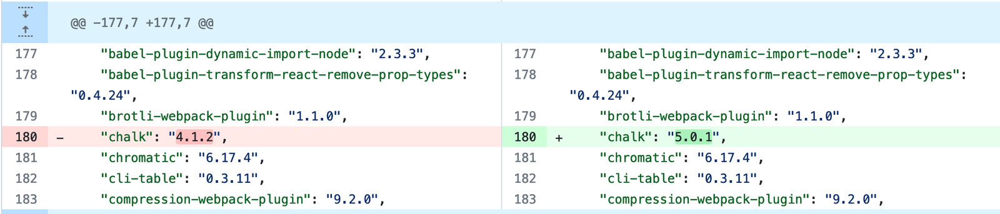

# How we upgraded the ESM dependency using Chalk as the first

## Introduction

ESM and CommonJS are two of Javascript module systems. Modules are pieces of code that have can be shared and reused in a module system. CJS was the default module system for Node.js. Each file is a separate module which can be imported and exported in your code. However, browsers did not have a module system, and it has taken a long time for one to be developed as it first needs to be standardised by ECMAScript and then be able to be used in browsers. This has now been completed in ES6 and now ESM are the standard for using modules in the browser. It is now supported natively in most web browsers, and is fast and comes with new features. You may recognise some of the syntax already as it has been used in React before it became standard, and has had to be transpiled by the tool Babel we use.

So there are now two module systems, ESM for browsers and CJS for Node. Unfortunately, these two systems use different syntax and work a bit differently. To use both of them, we need to change some things. CJS modules can be imported in ESM, but ESMs need workarounds to be used in a codebase of mostly CommonJS.

Here is a brief summary of the differences between these two ways of managing the code, from https://adamcoster.com/blog/commonjs-and-esm-importexport-compatibility-examples:

- CommonJS uses the `require('./file.js')` syntax for importing other modules and the `module.exports =` syntax for exporting stuff from modules
- ESM uses the `import {stuff} from './file.js'` syntax for importing and the `export stuff` syntax for exports
- CommonJS files can use the `.cjs` extension to tell Node that they are in CommonJS
- ESM files can use the `.mjs` extension to tell Node that they are in ESM
- CommonJS imports are _synchronous_
- ESM imports are _asynchronous_ (which also allows for [top-level](https://developer.mozilla.org/en-US/docs/Web/JavaScript/Reference/Operators/await#top_level_await) `[await](https://developer.mozilla.org/en-US/docs/Web/JavaScript/Reference/Operators/await#top_level_await)`)
- CommonJS works in Node but does **not** work in browsers
- ESM is supported by all modern browsers and the latest versions of Node, but does **not** work at all in Node versions below 12
- Tons of the core JavaScript ecosystem tooling was developed in Node, and Node only recently started to support ESM, so a huge fraction of existing Node projects are in CommonJS

## Starting the upgrade with Chalk as an example

We started by upgrading chalk in the package.json of the entire application.

After running `yarn`, you will also see changes in the yarn.lock file

After this, we allowed the github actions to run on the branch to see where we would get errors that informed us to where we needed to change syntax. The rest of the document will show what changes we had to make to use the ESM chalk. When you are upgrading other ESM dependencies, the places you need to make changes will differ, however some of the changes will be similar e.g adding the “type”: “module” declaration, changing the way you import and export files, using a different mocking method in tests and using asynchronous imports.

## Mark code as ES Module

One important code change that needs to happen to be able to use an ESM in CJS is declaring “type”: “module” in a package.json that is within the folder of your code using the ESM. This is telling node that ESM syntax will be used in this folder’s files.

In this screenshot, we have a package.json declaring this within the bundleSize folder. It is here because this is the folder in which Chalk, the ESM we are first using to test upgrading ESM dependencies, is being used in the code.

There is another way to mark code as ESM, which is used if you don’t want to it for a whole folder, but just for one file. You can change the file extension to .mjs to show that it is a script with which you want to use ESM. Similarly, if you have declared your code as ESM package-wide, you can declare particular files within that as CommonJS with the file extension .cjs. I have not tried doing this yet so haven’t tested that it works, but the documentation says it is possible.

## Changing the build and test scripts

We also need to execute node with ` --``experimental-modules `. Yes it is still experimental. Yes it will be ‘fun’ for a while.

We added this command to the scripts for `build` and `test:unit`. This allows ESM to work for command line script rather than CommonJS.

And to run this locally when developing, I would use ` --``experimental-modules ` in my terminal command.

In the `build` command you can see we also call the seperate file runBundleSize.js that pulls in our new modularised code and runs the script.

## Jest version

To be able to use the most up to date methods of mocking in ESM, we needed to upgrade to the latest version of Jest. This will not be covered here as it is not related to ESM dependency upgrades apart from you may need to keep it up to date to use all the features. It may need to continue to be updated to get the newest features of ESM that may be necessary.

Development of ESM tracking ticket https://github.com/jestjs/jest/issues/9430

## Imports

The way things are imported must be changed. Screenshot from https://dev.to/abbeyperini/tldr-commonjs-vs-esm-47dk.

The `import` keyword must be used. Here are some examples of the import changes we made in our code:

As Andrew says here, JSON can no longer be directly imported and instead we need to use `readFile` to read the file and `JSON.parse` to parse the JSON.

Jest also needs to be imported into each test file.

## Exports

The way things are exported must be changed. Screenshots from https://dev.to/abbeyperini/tldr-commonjs-vs-esm-47dk.

The `export` keyword must be used.
And with examples in our code:

And an example with an `import` and an `export`:

VScode recognises the need to change the type of export, and has a quick fix for it:
Hover over the highlighted problem (3 dots may also appear underneath), and when the pop up appears with the Quick Fix, you can select the ‘Convert to ES module” and it will do some of this for you.

## Mocking

One of the new features the latest version of Jest allows us to use is `jest.unstable_mockModule`.

Jest doesn’t yet have full support for ES modules, but it does have experimental support. Normally we would use `jest.mock()`, but as this can’t be used with ESM yet (Jest maintainers plan to support it in the future but do not yet have an official API ready), we instead can use the in-development experimental API.

There are differences in how we use this, compared to `jest.mock()`. For `jest.unstable_mockModule`, the previously optional factory function is now mandatory. A factory function is a function that creates an object and returns it, and can be considered like a constructor function. ` j``est.mock() ` has a useful automatic mock that mocks classes or constructor functions for you. When using `jest.mock()` you might still want to mock manually for more control with fake data, but the great thing about it is it allows for concise code and speed - one line of code for your mocking and not needing to write all the rest in yourself. With `jest.unstable_mockModule` we do not have the auto-mocking ability, and we must write the inside of the mock out by hand - ‘manual’ mocking. You can see this in the following screenshots where we have had to specify the named export mock functions in `fs` that we want to use. We would not be able to access and use `readdirSync`, for example, automatically.

If you have defined mocks in a `__mocks__` folder , these now also need to be manually loaded.
Example within a jest.unstable_mockModule:

Example within our code of it in an import:

## Asynchronous dynamic importing

`jest.unstable_mockModule` must be called at the top level, before the import for the module you are mocking. Then we need to use a dynamic import (instead of `require`). If we were using CommonJS, jest would automatically hoist the mock calls so that the mocking would happen before the imports. This does not work in ESM, so we must _explicitly_ use `jest.unstable_mockModule` before the mock modules that use the module resources are imported. See the following screenshots for examples of importing dynamically and awaiting those imports:

See how in all these examples we have the word ‘await’ and also the word ‘async’ as the function is now asyncronous.

AN IMPORTANT NOTE:

During our work on updating this dependency and using `jest.unstable_mockModule` for the first time, we found that because the API is not yet mature and is experimental, if you break ONE mock, it breaks ALL the mocks. Something to do with the injection across modules affecting them all. This is a problem with the API and will likely get better with more development time on it. In the meantime, make sure that your errors aren’t being caused by one broken mock before you start making lots of changes across the code trying to work out how to fix the error. We spent a lot of time on this before Andrew worked out what was happening. It was not mentioned in any docs online and led us on a wild goose chase.

## Typescript

We had some problems running the bundleSize script with typescript files from outside the directory. We tried to use `loadableConfig.ts`, which had a list of all the services for use in the tests, but it is outside the bundle size tests folder, and we found that we had difficulty running the bundleSize script from the command line, as typescript compiles the script into JS to run on the command line. We couldn’t get this compilation to happen, and decided it was not worth the time trying to do it this way, and instead to make a new file with the list of service that isn’t typescript and was in the same directory.

For further examples of code changes we made to upgrade chalk, please refer to the [Upgrade Chalk Dependency (ESM) PR](https://github.com/bbc/simorgh/pull/10937/files)

