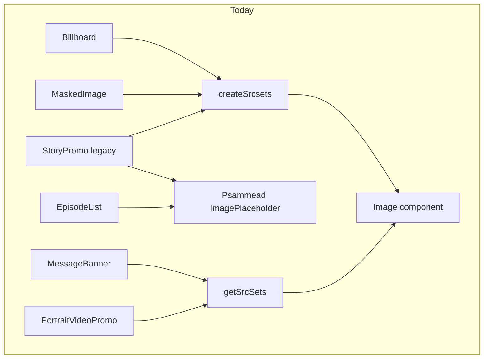
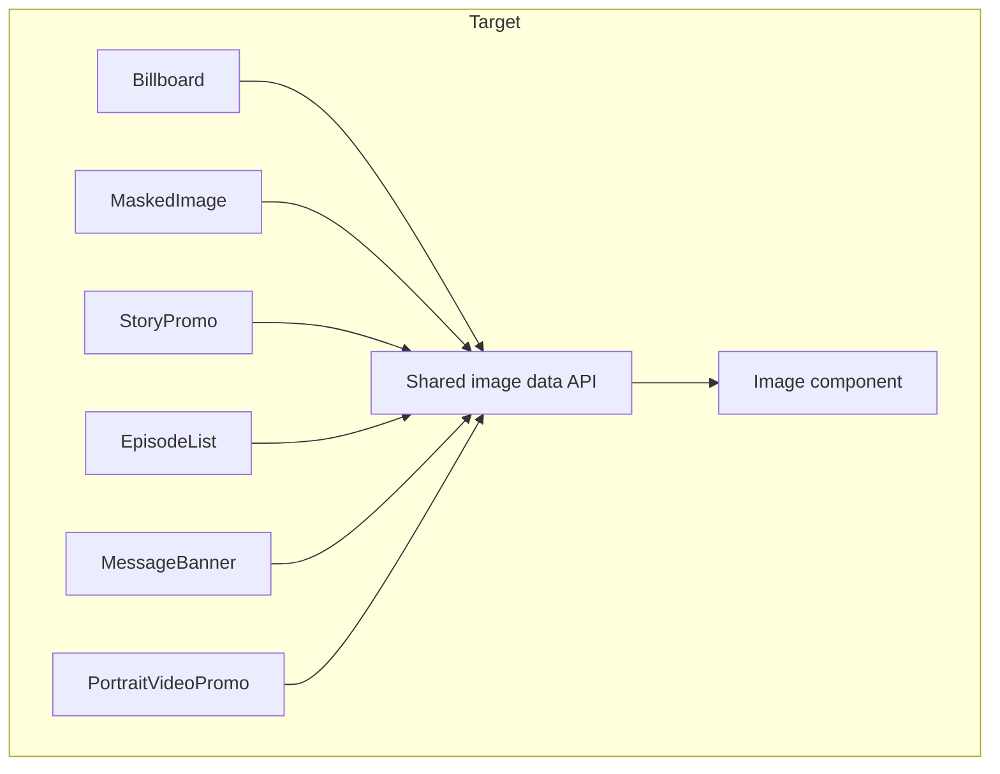
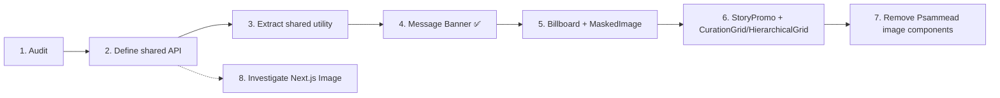

# Image Component Migration Plan

## Why

Image rendering logic in Simorgh is currently spread across several components,
each independently re-implementing srcset/mime-type/URL-building logic before
handing the result to the shared [`Image`](../src/app/components/Image)
component. This document is the output of the initial spike and defines the
audit, the target API, and an incremental migration order so the work can be
delivered as a series of small, low-risk PRs rather than one large refactor.

## Current state (audit)

All of the components below already render through the shared
[`Image`](../src/app/components/Image/index.tsx) component. The duplication is
in the **prep work** done before calling it.

| Consumer              | Location                                                                                                                                | Prep logic used                                                                                | Notes                                                                                                      |
| --------------------- | --------------------------------------------------------------------------------------------------------------------------------------- | ---------------------------------------------------------------------------------------------- | ---------------------------------------------------------------------------------------------------------- |
| `Billboard`           | [src/app/components/Billboard](../src/app/components/Billboard/index.tsx)                                                               | `createSrcsets` + `getOriginCode` + `getLocator` + `buildIChefURL` (from `#app/lib/utilities`) | Delegates to `MaskedImage` for non-high-prominence layout                                                  |
| `MaskedImage`         | [src/app/components/MaskedImage](../src/app/components/MaskedImage/index.tsx)                                                           | `createSrcsets` + `getOriginCode` + `getLocator`                                               | Duplicates the same origin/locator/srcset derivation as `Billboard`                                        |
| `MessageBanner`       | [src/app/components/MessageBanner](../src/app/components/MessageBanner/index.tsx)                                                       | ✅ Migrated to `getSrcSets` (`#app/utilities/getSrcSets`)                                      | Previously hand-rolled the same math that `getSrcSets` already implements and was already covered by tests |
| `StoryPromo` (legacy) | [src/app/legacy/containers/StoryPromo](../src/app/legacy/containers/StoryPromo/index.jsx)                                               | `createSrcsets` + `getOriginCode` + `getLocator` + Psammead `ImagePlaceholder` fallback        | Rendered by `CurationGrid` and `HierarchicalGrid`; largest blast radius                                    |
| `EpisodeList`         | [src/app/legacy/containers/EpisodeList/Image.jsx](../src/app/legacy/containers/EpisodeList/Image.jsx)                                   | Psammead `ImagePlaceholder`                                                                    | Still fully on the legacy placeholder component                                                            |
| `PortraitVideoPromo`  | [src/app/components/PortraitVideoCarousel/PortraitVideoPromo](../src/app/components/PortraitVideoCarousel/PortraitVideoPromo/index.tsx) | `getSrcSets`                                                                                   | Reference implementation for the utility other consumers should move to                                    |

Two parallel srcset utilities exist today and need to be reconciled:

- [`#app/lib/utilities/srcSet`](../src/app/lib/utilities/srcSet/index.js) — `createSrcsets` / `getMimeType`. Produces a **primary + fallback** (webp/jpeg) pair from a fixed resolution ladder. Used by `Billboard`, `MaskedImage`, `StoryPromo`.
- [`#app/utilities/getSrcSets`](../src/app/utilities/getSrcSets/index.ts) — produces a **2x-upscale small/large** srcset and matching `sizes`, driven by breakpoints. Used by `MessageBanner` (now), `PortraitVideoPromo`.

They solve different layout problems (resolution-ladder vs breakpoint 2x-upscale), so the API design step below should decide whether both are kept as distinct, named utilities, or unified behind one configurable function.

## Target architecture

The "Shared image data API" is the outcome of step 2 below — a single,
documented way to go from an iChef `urlTemplate` + a required width/breakpoint
strategy to the `src` / `srcSet` / `sizes` / `mediaType` props that `Image`
already accepts (see the [Image README](../src/app/components/Image/README.md)
for the current prop contract).

## Migration order

1. **Audit** — complete (this document).
2. **Define the shared API** — decide the final shape of the utility/utilities
   consumers call, and whether `srcSet` derivation should live in `Image`
   itself or stay as a standalone utility consumed before render.
3. **Extract shared utility** — consolidate `createSrcsets` and `getSrcSets`
   behind the agreed API, keeping [srcSet/index.test.js](../src/app/lib/utilities/srcSet/index.test.js)
   and [getSrcSets/index.test.ts](../src/app/utilities/getSrcSets/index.test.ts)
   as the regression baseline.
4. **Message Banner** — ✅ done. Replaced hand-rolled srcset math with the
   existing, tested `getSrcSets` utility. No visual or markup change; all 11
   existing tests pass unmodified.
5. **Billboard + MaskedImage** — migrate together, since `Billboard` already
   delegates to `MaskedImage` for its non-high-prominence layout.
6. **StoryPromo legacy wrapper** — highest risk step: rendered via
   `CurationGrid` and `HierarchicalGrid`, has large existing snapshots, and
   still depends on the Psammead placeholder for the no-image case.
7. **Remove Psammead image components** — only after confirming
   `#psammead/psammead-image-placeholder` has no remaining references outside
   `StoryPromo` and `EpisodeList`.
8. **Investigate Next.js `<Image>`** — spike in parallel with step 2; check
   compatibility with the `{width}` iChef URL templating and AMP rendering
   path before committing to it as the long-term implementation.

## Risks / blockers

- `StoryPromo`'s image path is exercised by large snapshot tests
  ([`__snapshots__/index.test.jsx.snap`](../src/app/legacy/containers/StoryPromo/__snapshots__/index.test.jsx.snap))
  — expect snapshot updates, not just logic changes, in step 6.
- `Image`'s fallback (`<picture>`) rendering is currently gated to
  `pageType === HOME_PAGE` only (see [Image/index.tsx](../src/app/components/Image/index.tsx)).
  Any consumer relying on `fallbackSrcSet` outside the home page will not get
  the `<picture>` fallback today — worth resolving as part of step 2.
- AMP rendering (`isAmp`) is a separate code path inside `Image` and must be
  covered by any consumer migration test.
- Removing Psammead components (step 7) should not start until step 6 is
  complete and merged, to avoid breaking `StoryPromo` mid-migration.
