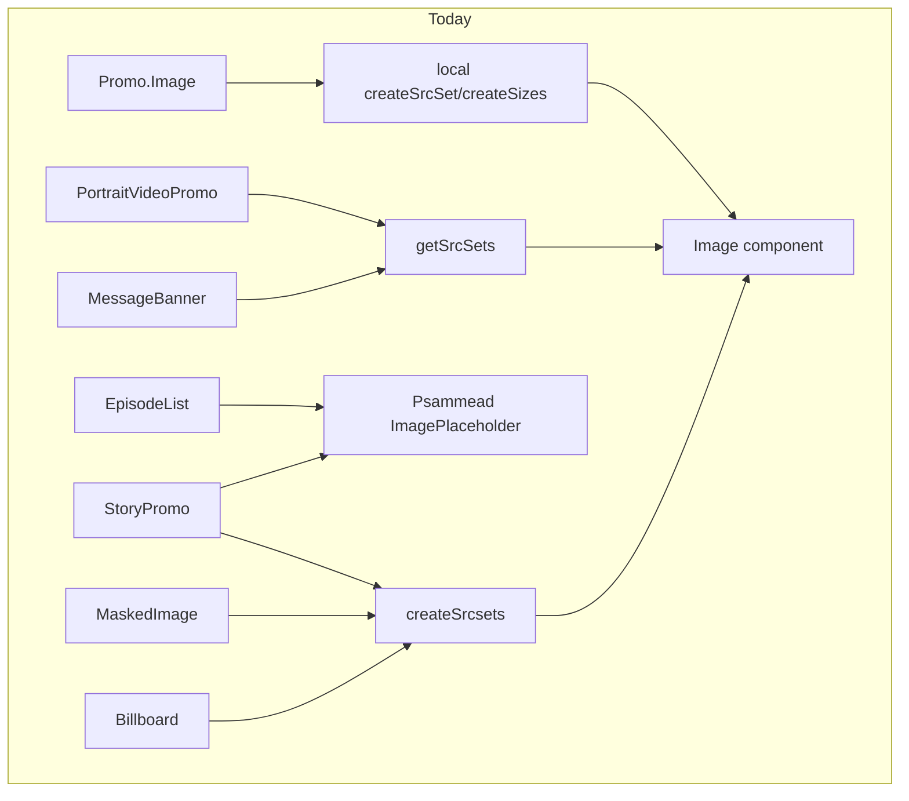
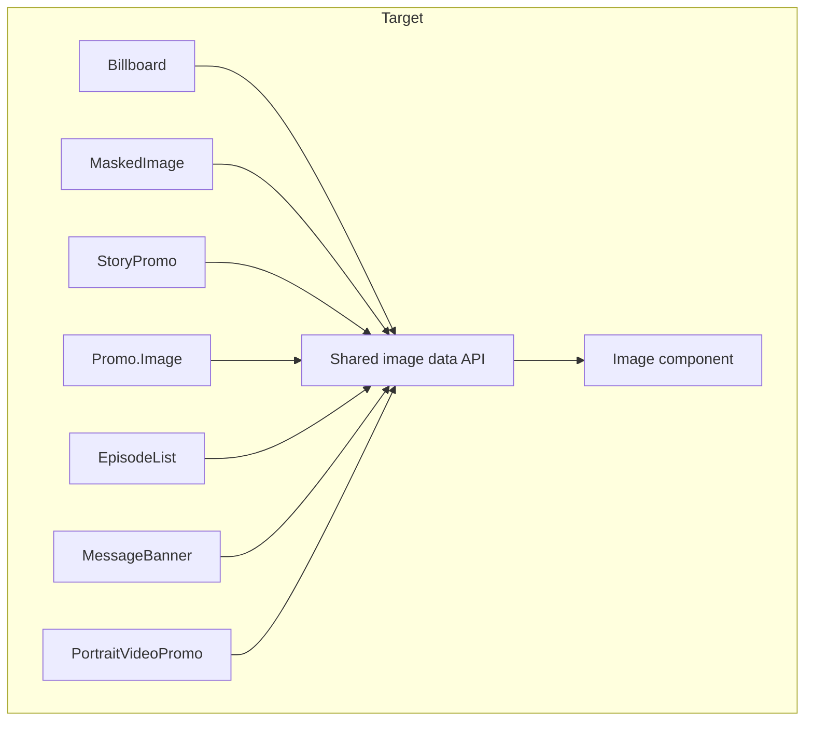
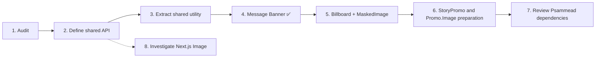

# Image Component Migration Plan

## Why

The modern [`Image`](https://github.com/bbc/simorgh/blob/latest/src/app/components/Image/index.tsx)
primitive is used by several image and promo components. However, image URL,
source-set, MIME-type, and fallback preparation is still implemented in
multiple places before values are passed to that primitive. This document
records the initial audit and defines an incremental approach to consolidating
that preparation logic.

## Current state (audit)

`StoryPromo` and `Promo.Image` already render through the shared
[`Image`](https://github.com/bbc/simorgh/blob/latest/src/app/components/Image/index.tsx)
primitive. The duplication is primarily in the preparation performed before
rendering it. `EpisodeList` remains a separate legacy implementation.

| Consumer             | Location                                                                                                                                                                        | Prep logic used                                                    | Notes                                                                                                     |
| -------------------- | ------------------------------------------------------------------------------------------------------------------------------------------------------------------------------- | ------------------------------------------------------------------ | --------------------------------------------------------------------------------------------------------- |
| `Billboard`          | [src/app/components/Billboard](https://github.com/bbc/simorgh/blob/latest/src/app/components/Billboard/index.tsx)                                                               | `createSrcsets` + `getOriginCode` + `getLocator` + `buildIChefURL` | Delegates to `MaskedImage` for non-high-prominence layout                                                 |
| `MaskedImage`        | [src/app/components/MaskedImage](https://github.com/bbc/simorgh/blob/latest/src/app/components/MaskedImage/index.tsx)                                                           | `createSrcsets` + `getOriginCode` + `getLocator`                   | Repeats the image-preparation pattern used by `Billboard`                                                 |
| `MessageBanner`      | [src/app/components/MessageBanner](https://github.com/bbc/simorgh/blob/latest/src/app/components/MessageBanner/index.tsx)                                                       | `getSrcSets` (`#app/utilities/getSrcSets`)                         | Uses the existing shared utility rather than constructing `srcSet` and `sizes` locally                    |
| `StoryPromo`         | [src/app/legacy/containers/StoryPromo](https://github.com/bbc/simorgh/blob/latest/src/app/legacy/containers/StoryPromo/index.jsx)                                               | `createSrcsets` + `getOriginCode` + `getLocator` + `buildIChefURL` | Already renders the modern `Image` primitive; uses Psammead `ImagePlaceholder` when no image is available |
| `Promo.Image`        | [src/app/legacy/components/Promo/image.jsx](https://github.com/bbc/simorgh/blob/latest/src/app/legacy/components/Promo/image.jsx)                                               | Local `createSrcSet` and `createSizes` helpers                     | Already renders the modern `Image` primitive but duplicates responsive image generation                   |
| `EpisodeList`        | [src/app/legacy/containers/EpisodeList/Image.jsx](https://github.com/bbc/simorgh/blob/latest/src/app/legacy/containers/EpisodeList/Image.jsx)                                   | Direct `img` element plus Psammead `ImagePlaceholder`              | Separate legacy implementation                                                                            |
| `PortraitVideoPromo` | [src/app/components/PortraitVideoCarousel/PortraitVideoPromo](https://github.com/bbc/simorgh/blob/latest/src/app/components/PortraitVideoCarousel/PortraitVideoPromo/index.tsx) | `getSrcSets`                                                       | Existing example of using the shared utility                                                              |

Two parallel srcset utilities exist today and need to be reconciled:

- [`#app/lib/utilities/srcSet`](https://github.com/bbc/simorgh/blob/latest/src/app/lib/utilities/srcSet/index.js) — `createSrcsets` / `getMimeType`. Produces a **primary + fallback** (webp/jpeg) pair from a fixed resolution ladder. Used by `Billboard`, `MaskedImage`, and `StoryPromo`.
- [`#app/utilities/getSrcSets`](https://github.com/bbc/simorgh/blob/latest/src/app/utilities/getSrcSets/index.ts) — produces a **2x-upscale small/large** srcset and matching `sizes`, driven by breakpoints. Used by `MessageBanner` and `PortraitVideoPromo`.

They solve different layout problems (resolution-ladder vs breakpoint 2x-upscale), so the API design step below should decide whether both are kept as distinct, named utilities, or unified behind one configurable function.

## Target architecture

The "Shared image data API" is the outcome of step 2 below — a single,
documented way to go from an iChef `urlTemplate` + a required width/breakpoint
strategy to the `src` / `srcSet` / `sizes` / `mediaType` props that `Image`
already accepts (see the [Image README](https://github.com/bbc/simorgh/blob/latest/src/app/components/Image/README.md)
for the current prop contract).

## Migration order

1. **Audit** — complete (this document).
2. **Define the shared API** — decide the final shape of the utility/utilities
   consumers call, and whether `srcSet` derivation should live in `Image`
   itself or stay as a standalone utility consumed before render.
3. **Extract shared utility** — consolidate `createSrcsets` and `getSrcSets`
   behind the agreed API, keeping [srcSet/index.test.js](https://github.com/bbc/simorgh/blob/latest/src/app/lib/utilities/srcSet/index.test.js)
   and [getSrcSets/index.test.ts](https://github.com/bbc/simorgh/blob/latest/src/app/utilities/getSrcSets/index.test.ts)
   as the regression baseline.
4. **Message Banner** — ✅ done. Replaced hand-rolled srcset math with the
   existing, tested `getSrcSets` utility. No visual or markup change; all 11
   existing tests pass unmodified.
5. **Billboard + MaskedImage** — migrate together, since `Billboard` already
   delegates to `MaskedImage` for its non-high-prominence layout.
6. **Review StoryPromo and Promo.Image preparation logic** — consolidate
   duplicated source-set, fallback, and sizing logic while preserving their
   existing primitive `Image` rendering.
7. **Review Psammead dependencies** — identify all production consumers of
   `psammead-image` and `psammead-image-placeholder`, including
   `ImageWithPlaceholder`, `OnDemandImage`, `PodcastPromo`, `StoryPromo`, and
   `EpisodeList`, before scheduling removals.
8. **Investigate Next.js `<Image>`** — spike in parallel with step 2; check
   compatibility with the `{width}` iChef URL templating and AMP rendering
   path before committing to it as the long-term implementation.

## Risks / blockers

- `StoryPromo` and `Promo.Image` already use the modern `Image` primitive.
  Future changes should consolidate their image-preparation logic rather than
  repeat the completed primitive migration.
- Direct Psammead image and placeholder usage extends beyond `StoryPromo` and
  `EpisodeList`; removal work requires a complete production-usage audit.
- `Image`'s fallback (`<picture>`) rendering is currently gated to
  `pageType === HOME_PAGE` only (see [Image/index.tsx](https://github.com/bbc/simorgh/blob/latest/src/app/components/Image/index.tsx)).
  Any consumer relying on `fallbackSrcSet` outside the home page will not get
  the `<picture>` fallback today — worth resolving as part of step 2.
- AMP rendering (`isAmp`) is a separate code path inside `Image` and must be
  covered by any consumer migration test.
- CAF rollout may remove legacy consumers. Reassess the scope before investing
  in migrations for components expected to be removed.
