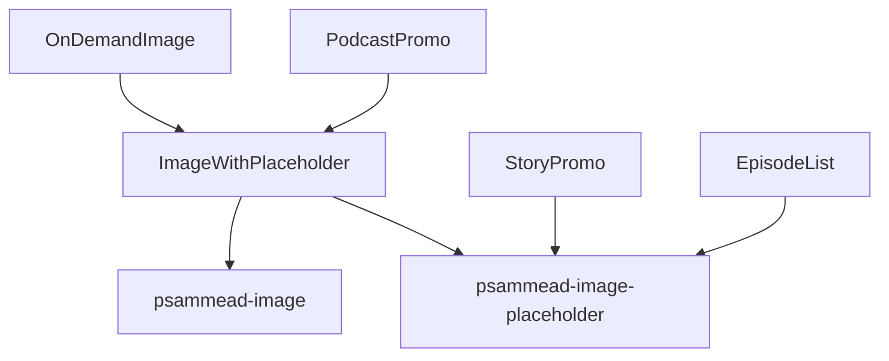

# Image Rendering Audit

## Scope and method

This audit covers production files under `src/app`. Tests, stories, fixtures,
and README examples are excluded unless they describe a production contract. A
consumer is a component that renders an image directly, or prepares image props
for a renderer.

## Image primitive contract

The modern [`Image`](../src/app/components/Image/index.tsx) is the shared
renderer. It returns `null` for Lite pages, and otherwise owns the following
behaviour:

| Behaviour           | Current implementation                                                                                                                              | Migration requirement                                                               |
| ------------------- | --------------------------------------------------------------------------------------------------------------------------------------------------- | ----------------------------------------------------------------------------------- |
| Canonical rendering | Renders ``; wraps it in `<picture>` when both source sets are present on the home page.                                                        | Preserve semantic `alt`, `src`, dimensions and `sizes`.                             |
| AMP                 | Renders `<amp-img>` with `responsive` layout when dimensions exist, otherwise `fill`; preloaded images receive `data-hero`.                         | Exercise AMP for every migrated high-traffic path.                                  |
| Placeholder         | Shows the shared BBC-block placeholder until `onLoad`; supports a dark background.                                                                  | Preserve enabled/disabled and dark-placeholder choices.                             |
| Lazy loading        | Uses native `loading="lazy"`; eager is the default.                                                                                                 | Preserve existing lazy/eager decisions.                                             |
| Preload             | Emits `<link rel="preload" as="image">` with source set and sizes.                                                                                  | Limit to current above-the-fold images and retain `fetchPriority="high"`.           |
| Aspect ratio        | Uses supplied `aspectRatio` or dimensions for CSS `aspect-ratio` and legacy padding-ratio layout stability.                                         | Do not migrate paths without explicitly retaining their CLS contract.               |
| Fallback            | Typed WebP/JPEG `<picture>` sources are emitted only when both sets exist and `pageType === HOME_PAGE`. Other pages receive the primary source set. | Decide whether this page-type gate is intentional before relying on fallback props. |

## Image preparation utilities

| Utility           | Source                                                   | Behaviour                                                                                                                           | Consumers                                                                                                          |
| ----------------- | -------------------------------------------------------- | ----------------------------------------------------------------------------------------------------------------------------------- | ------------------------------------------------------------------------------------------------------------------ |
| iChef URL builder | [`ichefURL`](../src/app/lib/utilities/ichefURL/index.js) | Builds iChef URLs, appends `.webp` only for supported iChef recipes, and produces programme placeholders for `mpv`/`pips`.          | `Billboard`, `StoryPromo`, article/promo preparation, related content and author images.                           |
| Resolution ladder | [`srcSet`](../src/app/lib/utilities/srcSet/index.js)     | Builds candidates from a resolution ladder, plus MIME types and a JPEG fallback set by removing `.webp`. `pips` has no source sets. | `Billboard`, `MaskedImage`, `StoryPromo`, `ImageWithCaption`, Frosted Glass, related/recommendation/social promos. |
| Breakpoint 2x     | [`getSrcSets`](../src/app/utilities/getSrcSets/index.ts) | Produces small/large 1x and 2x candidates and matching breakpoint `sizes`. It does not add MIME types or fallbacks.                 | `MessageBanner`, `PortraitVideoPromo`.                                                                             |

The utilities model two distinct requirements: a bounded resolution ladder and a
breakpoint-specific 2x strategy. The shared API should make that strategy
explicit rather than select one implicitly.

## Production consumer inventory

| Consumer                    | Source                                                                                                                                                                                                                                                 | Preparation and dependencies                                                                                                            | Required behaviour                                                                                                               | Status                                            |
| --------------------------- | ------------------------------------------------------------------------------------------------------------------------------------------------------------------------------------------------------------------------------------------------------ | --------------------------------------------------------------------------------------------------------------------------------------- | -------------------------------------------------------------------------------------------------------------------------------- | ------------------------------------------------- |
| `Billboard`                 | [`Billboard`](../src/app/components/Billboard/index.tsx)                                                                                                                                                                                               | High prominence uses iChef URL plus `createSrcsets`; other prominence delegates to `MaskedImage`.                                       | High: 800x533, WebP/JPEG metadata, explicit sizes, no placeholder, preload and high priority. Non-high: retain masking/vignette. | Active modern                                     |
| `MaskedImage`               | [`MaskedImage`](../src/app/components/MaskedImage/index.tsx)                                                                                                                                                                                           | Parses iChef template with `getOriginCode`/`getLocator`, then uses `createSrcsets`.                                                     | RTL-aware mask or vignette, optional full height, 800x533 unless single-image, configurable placeholder, preload/high priority.  | Active modern                                     |
| `MessageBanner`             | [`MessageBanner`](../src/app/components/MessageBanner/index.tsx)                                                                                                                                                                                       | `getSrcSets` from an iChef `{width}` template.                                                                                          | Decorative alt text, 16:9, no placeholder, breakpoint sizes.                                                                     | Active modern                                     |
| `StoryPromo`                | [`StoryPromo`](../src/app/legacy/containers/StoryPromo/index.jsx)                                                                                                                                                                                      | iChef URL and custom resolution ladder; direct `psammead-image-placeholder` when image data is absent. Uses Psammead StoryPromo layout. | CMS alt/dimensions/attribution, page- and promo-type-specific sizes, lazy by default, AMP.                                       | Legacy; CAF decision required                     |
| `Promo.Image`               | [`Promo.Image`](../src/app/legacy/components/Promo/image.jsx)                                                                                                                                                                                          | Local source-set and sizes helpers; separate programme-image resolutions; optional blurred portrait background.                         | 16:9, WebP/JPEG sets and MIME types, portrait containment/background.                                                            | Legacy renderer adapter; migrate only if retained |
| Optimo `Promo.Image`        | [`OptimoPromos Image`](../src/app/legacy/components/OptimoPromos/Image/index.jsx)                                                                                                                                                                      | Receives prebuilt source sets from [`RelatedContentItem`](../src/app/components/RelatedContentSection/RelatedContentItem/index.tsx).    | Lazy, 16:9, optional portrait placeholder removal. It omits MIME metadata, so typed fallback cannot activate.                    | Legacy adapter; fix when retained                 |
| `EpisodeList`               | [`Episode image`](../src/app/legacy/containers/EpisodeList/Image.jsx)                                                                                                                                                                                  | Direct `` inside `psammead-image-placeholder`.                                                                                     | 16:9 placeholder, responsive fixed widths, play/duration overlay, Lite-only play UI.                                             | Legacy; CAF removal candidate                     |
| `OnDemandImage`             | [`OnDemandImage`](../src/app/legacy/containers/OnDemandImage/index.jsx)                                                                                                                                                                                | Generates Programme `$recipe` square URLs and WebP-only source set; uses `ImageWithPlaceholder`.                                        | Square 256px source, 128/256/480 candidates plus 1200 on podcast episodes, Lite hidden.                                          | Legacy; CAF removal candidate                     |
| `PodcastPromo`              | [`shared preparation`](../src/app/legacy/containers/PodcastPromo/shared.js), [`inline`](../src/app/legacy/containers/PodcastPromo/Inline.jsx), [`secondary`](../src/app/legacy/containers/PodcastPromo/SecondaryColumn.jsx)                            | Programme `$recipe` 128/240/480 WebP set; uses `ImageWithPlaceholder`.                                                                  | Square image, lazy loading, 228px desktop / 30vw sizing; Inline is Lite hidden.                                                  | Legacy; CAF removal candidate                     |
| `ImageWithPlaceholder`      | [`legacy adapter`](../src/app/legacy/containers/ImageWithPlaceholder/index.jsx)                                                                                                                                                                        | Sole production importer of `psammead-image`; wraps it with `psammead-image-placeholder` and `react-lazyload`.                          | Legacy load-state placeholder, optional noscript fallback, legacy AMP, preload support.                                          | Legacy; CAF removal candidate                     |
| `ImageWithCaption`          | [`ImageWithCaption`](../src/app/components/ImageWithCaption/index.tsx)                                                                                                                                                                                 | iChef URL plus resolution ladder and MIME fallback.                                                                                     | Article image alt/copyright/caption, position-based lazy/preload and fetch priority, dimensions and AMP handling.                | Active modern                                     |
| `FrostedGlassPromo`         | [`data preparation`](../src/app/components/FrostedGlassPromo/withData.tsx), [`renderer`](../src/app/components/FrostedGlassPromo/index.tsx)                                                                                                            | iChef URL, one 400px source-set candidate and MIME fallback; separate panel lazy load.                                                  | Lazy image, dark canonical placeholder, responsive metadata passed through.                                                      | Active modern                                     |
| `PortraitVideoPromo`        | [`PortraitVideoPromo`](../src/app/components/PortraitVideoCarousel/PortraitVideoPromo/index.tsx)                                                                                                                                                       | `getSrcSets` primary and an extension-stripped fallback set.                                                                            | Decorative/meaningful CMS alt, 9:16, lazy loading and carousel layout. Fallback MIME types are missing.                          | Active modern; fallback gap                       |
| `RecommendationsPromoImage` | [`Recommendations image`](../src/app/components/Recommendations/RecommendationsPromoImage/index.tsx)                                                                                                                                                   | iChef URL and resolution ladder.                                                                                                        | CMS alt/attribution, supplied aspect ratio, optional lazy load. MIME types are omitted.                                          | Active modern; fallback gap                       |
| `SocialLinks`               | [`SocialLinks`](../src/app/components/SocialLinks/index.tsx)                                                                                                                                                                                           | Two-candidate iChef ladder with MIME fallback; local CSS placeholder if no template.                                                    | Decorative, lazy image; 1x/2x source set.                                                                                        | Active modern                                     |
| Contributor portraits       | [`article contributor`](../src/app/components/Byline/ArticleContributor/index.tsx), [`post contributor`](../src/app/components/Byline/PostContributor/index.tsx), [`URL extraction`](../src/app/components/Byline/utilities/bylineExtractor/index.tsx) | iChef produces a 160px WebP URL.                                                                                                        | Decorative square portrait, no placeholder or source set.                                                                        | Active modern                                     |
| Embedded images             | [`EmbedImages`](../src/app/components/Embeds/EmbedImages/index.tsx)                                                                                                                                                                                    | Builds a direct environment-specific iChef news URL.                                                                                    | CMS alt and dimensions; Lite hidden.                                                                                             | Active modern                                     |
| Media-player poster         | [`MediaLoader placeholder`](../src/app/components/MediaLoader/Placeholder/index.tsx), [`Ares config`](../src/app/components/MediaLoader/configs/aresMedia.ts), [`live-post config`](../src/app/components/MediaLoader/configs/livePostClipMedia.ts)    | Media config prepares poster URL/source set.                                                                                            | Decorative poster behind playable media; portrait positioning supported.                                                         | Active modern                                     |

## Legacy dependency graph

`psammead-image` has one production importer: `ImageWithPlaceholder`. Direct
production users of `psammead-image-placeholder` are `ImageWithPlaceholder`,
`StoryPromo`, and `EpisodeList`. Other repository references are test, story,
or documentation support.

## CAF disposition

| Component                 | Current dependency                                               | Disposition                                                                              |
| ------------------------- | ---------------------------------------------------------------- | ---------------------------------------------------------------------------------------- |
| `ImageWithPlaceholder`    | `psammead-image`, `psammead-image-placeholder`, `react-lazyload` | CAF removal candidate; confirm ownership/timeline before a migration.                    |
| `OnDemandImage`           | `ImageWithPlaceholder`                                           | CAF removal candidate; otherwise migrate Programme recipe preparation and square layout. |
| `PodcastPromo`            | `ImageWithPlaceholder`                                           | CAF removal candidate; otherwise migrate both layouts together.                          |
| `EpisodeList` image       | Direct Psammead placeholder and raw ``                      | CAF removal candidate; otherwise replace directly with modern `Image`.                   |
| `StoryPromo` presentation | Psammead StoryPromo and placeholder                              | CAF decision required; preparation can be modernised independently if retained.          |
| `Promo.Image`             | Legacy promo layout with modern `Image` renderer                 | Retain only if its layout remains after CAF; migrate preparation, not the primitive.     |

No CAF schedule or ownership record was found in production source. These are
candidates, not confirmed removals.

## Risks and blockers

| Risk or blocker                | Affected paths                                                            | Agreed handling                                                                         |
| ------------------------------ | ------------------------------------------------------------------------- | --------------------------------------------------------------------------------------- |
| Home-page-only typed fallback  | Every caller supplying WebP/JPEG sets                                     | Decide and test the desired non-home-page behaviour before consolidating preparation.   |
| Missing fallback MIME metadata | `PortraitVideoPromo`, `RecommendationsPromoImage`, Optimo promo adapter   | Supply MIME metadata or remove unused fallback data as part of that policy decision.    |
| AMP is a separate renderer     | All migrations with AMP support, especially StoryPromo and article images | Add canonical and AMP assertions before replacing a preparation path.                   |
| iChef URL variants             | CMS images, `mpv`, `pips`, Programme `$recipe` URLs                       | Preserve `buildIChefURL` eligibility logic; Programme recipes need a distinct strategy. |
| CLS and crop behaviour         | Fixed/portrait paths and all above-the-fold images                        | Preserve dimensions or explicit ratio, `object-fit`, and portrait/background treatment. |
| CAF uncertainty                | Legacy adapter chain                                                      | Confirm removal scope before investing in legacy migration.                             |

## Recommended migration order

1. Agree the `Image` fallback policy, including canonical versus AMP and home
   versus non-home page output; add focused tests for the decision.
2. Define a shared image-data API with explicit `resolutionLadder`,
   `breakpoint2x`, and Programme-recipe strategies. Keep rendering in `Image`.
3. Extract and test the API against existing [`srcSet` tests](../src/app/lib/utilities/srcSet/index.test.js) and [`getSrcSets` tests](../src/app/utilities/getSrcSets/index.test.ts).
4. Migrate `Billboard` and `MaskedImage` together, retaining all prominence,
   mask, preload and priority behaviour.
5. Migrate active preparation-only consumers: `ImageWithCaption`, Frosted
   Glass, recommendations, social links, related content and portrait video.
   Resolve missing fallback MIME metadata in this step.
6. Migrate retained `StoryPromo`, `Promo.Image` and Optimo promo preparation,
   without changing their presentation contracts.
7. Confirm CAF disposition. Remove the legacy `ImageWithPlaceholder` chain
   where CAF replaces it; otherwise migrate `OnDemandImage`, `PodcastPromo`
   and `EpisodeList` as one legacy workstream.
8. Investigate Next.js `Image` only after the source-set API and AMP contract
   are agreed; it must support iChef templates, responsive sets and AMP.

## Validation matrix

| Scenario             | Required coverage                                                         |
| -------------------- | ------------------------------------------------------------------------- |
| Canonical image      | `alt`, `src`, `srcSet`, `sizes`, dimensions and crop/layout.              |
| WebP fallback        | Supported and unsupported WebP, on home and non-home pages.               |
| Placeholder          | Initial state, `onLoad` removal, dark and disabled variants.              |
| Loading              | Native lazy/eager, noscript where retained, preload and fetch priority.   |
| AMP and Lite         | AMP layout, source set, hero preload; Lite suppression or replacement UI. |
| Responsive stability | Ratio/dimensions and portrait layouts at affected breakpoints.            |
