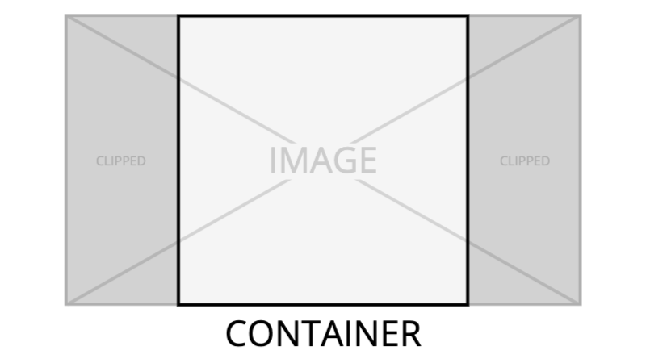

# Image

## Description

The `Image` component is used to render an image. It supports responsive images, fallback images (e.g. jpeg when webp is not supported), preloading, lazy loading, placeholder images and AMP images.

### Aspect ratio and the web-vitals [CLS](https://web.dev/cls/) (Cumulative Layout Shift) metric

The `Image` component uses an aspect ratio to prevent layout shift and preserve visual stability which contributes to a page's CLS metric. The aspect ratio is calculated using `width` and `height` props when provided but you can override this with a custom aspect ratio using the `aspectRatio` prop or use this prop if you do not know `width` and `height`. If neither `width`, `height` or `aspectRatio` is provided then a default aspect ratio of 16 / 9 will be used.

#### How does aspect ratio work?

For an aspect ratio box that works on legacy as well as modern browsers, the aspect ratio is applied to a wrapping `div` with an [unintuitive CSS technique](https://css-tricks.com/aspect-ratio-boxes/#aa-the-core-concept-padding-in-percentages-is-based-on-width) using the `padding-bottom` property. We apply this property as an inline style so Emotion does not create multiple CSS classes with the same base64 encoded background image causing CSS bloat. More information on why this happens can be found [here](../../../../docs/Coding-Standards/Styles.md#css-in-js-be-aware-that-passing-props-to-styled-components-will-generate-a-new-class-for-different-arguments) and [here](https://emotion.sh/docs/best-practices#use-the-style-prop-for-dynamic-styles). We also apply the new `aspectRatio` and `objectFit:cover` CSS properties to the image to ensure it fills the container and is centered horizontally and vertically when the image bleeds out of the parent container which happens when you force an aspect ratio on an image where the intrinsic aspect ratio is different. See the image below for a demonstration where we force aspect ratio of 1 / 1 on an image that intrinsically is 16 / 9.



_An example of what happens when the `aspectRatio` prop is different from the image's intrinsic aspect ratio._

## Props

| Name               | type                   | Description                                                                                                                                                                                                      |
| ------------------ | ---------------------- | ---------------------------------------------------------------------------------------------------------------------------------------------------------------------------------------------------------------- |
| alt                | string                 | the image alt text                                                                                                                                                                                               |
| src                | string                 | the src attribute for the img element                                                                                                                                                                            |
| srcSet?            | string                 | the primary srcset (probably the webp images)                                                                                                                                                                    |
| mediaType?         | string                 | the primary image mediaType e.g. "image/webp"                                                                                                                                                                    |
| fallbackSrcSet?    | string                 | the fallback srcset (probably the jpeg images)                                                                                                                                                                   |
| sizes?             | string                 | the responsive sizes attribute, used in conjunction with srcsets so the browser selects the appropriate image to render                                                                                          |
| fallbackMediaType? | string                 | the primary image mediaType e.g. "image/jpeg"                                                                                                                                                                    |
| width?             | number                 | the width attribute for the image element                                                                                                                                                                        |
| height?            | number                 | the height attribute for the image element                                                                                                                                                                       |
| className?         | string                 | this prop is used by Emotion to provide ability to add styles                                                                                                                                                    |
| aspectRatio?       | [x: number, y: number] | use this prop if you want to use a custom aspect ratio e.g. `[16, 9]` that overrides the aspect ratio inferred from the `width` and `height` props. also useful if you don't have the `width` and `height` props |
| lazyLoad?          | boolean                | whether or not the image should lazy load                                                                                                                                                                        |
| preload?           | boolean                | whether or not the image should preload                                                                                                                                                                          |
| placeholder?       | boolean                | whether or not to render a placeholder background image                                                                                                                                                          |
| isAmp?             | boolean                | whether or not to render an AMP image                                                                                                                                                                            |
| attribution?       | string                 | a string that indicates the attribution of the image. this is an [AMP specific](https://amp.dev/documentation/components/amp-img#attribution) prop                                                               |

## How to use

This is how to render a basic image (non-responsive):

```tsx
<Image
  alt="A penguin stands on an ice floe"
  src="https://ichef.bbci.co.uk/news/624/cpsprodpb/164AF/production/_110911319_antartica.jpg"
  width={500}
  height={281}
/>
```

This is how to render a responsive image:

```tsx
<Image
  alt="A penguin stands on an ice floe"
  src="https://ichef.bbci.co.uk/news/624/cpsprodpb/164AF/production/_110911319_antartica.jpg"
  srcSet="https://ichef.bbci.co.uk/news/240/cpsprodpb/164AF/production/_110911319_antartica.jpg 240w, https://ichef.bbci.co.uk/news/624/cpsprodpb/164AF/production/_110911319_antartica.jpg 624w"
  sizes="(min-width: 1008px) 645px, 100vw"
  width={500}
  height={281}
/>
```

This is how to render a basic webp image with jpeg fallback (non-responsive):

```tsx
<Image
  alt="A penguin stands on an ice floe"
  src="https://ichef.bbci.co.uk/news/624/cpsprodpb/164AF/production/_110911319_antartica.jpg"
  srcSet="https://ichef.bbci.co.uk/news/624/cpsprodpb/164AF/production/_110911319_antartica.jpg.webp"
  mediaType="image/webp"
  fallbackSrcSet="https://ichef.bbci.co.uk/news/624/cpsprodpb/164AF/production/_110911319_antartica.jpg"
  fallbackMediaType="image/jpeg"
  width={500}
  height={281}
/>
```

This is how to render a responsive webp image with a jpeg fallback:

```tsx
<Image
  alt="A penguin stands on an ice floe"
  src="https://ichef.bbci.co.uk/news/624/cpsprodpb/164AF/production/_110911319_antartica.jpg"
  srcSet="https://ichef.bbci.co.uk/news/240/cpsprodpb/164AF/production/_110911319_antartica.jpg.webp 240w, https://ichef.bbci.co.uk/news/624/cpsprodpb/164AF/production/_110911319_antartica.jpg.webp 624w"
  mediaType="image/webp"
  fallbackSrcSet="https://ichef.bbci.co.uk/news/240/cpsprodpb/164AF/production/_110911319_antartica.jpg 240w, https://ichef.bbci.co.uk/news/624/cpsprodpb/164AF/production/_110911319_antartica.jpg 624w"
  fallbackMediaType="image/jpeg"
  sizes="(min-width: 1008px) 645px, 100vw"
  width={500}
  height={281}
/>
```

You can generate the `srcSet`, `mediaType`, `fallbackSrcSet`, and `fallbackMediaType` props using the [`createSrcsets`](../../lib/utilities/srcSet/index.js) function. For example:

```tsx
const src =
  'https://ichef.bbci.co.uk/news/624/cpsprodpb/164AF/production/_110911319_antartica.jpg';

const { srcSet, primaryMimeType, fallbackSrcSet, fallbackMimeType } =
  createSrcsets({
    originCode: 'cpsprodpb',
    locator: src,
    originalImageWidth: 500,
    imageResolutions: [200, 500, 1000],
  });

<Image
  isAmp={false}
  alt="A penguin stands on an ice floe"
  src={src}
  srcSet={srcSet}
  mediaType={primaryMimeType}
  fallbackSrcSet={fallbackSrcSet}
  fallbackMediaType={fallbackMimeType}
  sizes="(min-width: 1008px) 645px, 100vw"
  width={500}
  height={281}
/>;
```
