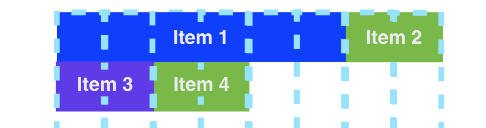
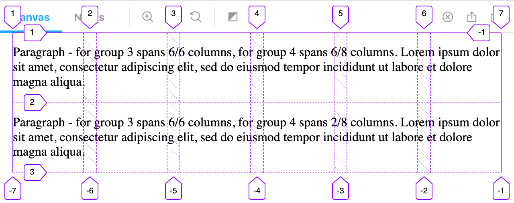
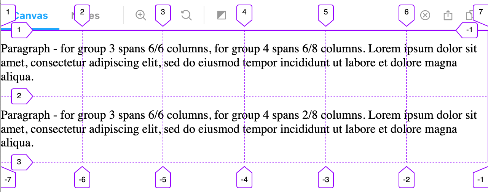

<!-- prettier-ignore -->
# psammead-grid - [](https://snyk.io/test/github/bbc/psammead?targetFile=packages%2Fcomponents%2Fpsammead-grid%2Fpackage.json) [](https://david-dm.org/bbc/psammead?path=packages/components/psammead-grid) [](https://david-dm.org/bbc/psammead?path=packages/components/psammead-grid&type=peer) [](https://bbc.github.io/psammead/?path=/story/grid--default) [](https://github.com/bbc/psammead/blob/latest/LICENSE) [](https://www.npmjs.com/package/#legacy/psammead-grid/src) [](https://github.com/bbc/psammead/blob/latest/CONTRIBUTING.md)

## Description

Psammead Grid is a component that you can use to set out column-based layouts using CSS Grid. It is set up to follow the standard [GEL groups for breakpoints](https://www.bbc.co.uk/gel/guidelines/grid#grid-sizes) and you can toggle on the GEL margins, gutters and fixed widths, in accordance with the GEL grid guidelines if you are using it for page layouts.

## Installation

`npm install #legacy/psammead-grid/src`

## Props

<!-- prettier-ignore -->
| Argument | Type | Required | Default | Example |
| -------- | ---- | -------- | ------- | ------- |
| columns | object | yes | N/A | `{ group0: 6, group1: 6, group2: 6, group3: 6, group4: 8, group5: 20 }` |
| startOffset | object | no | Sets all values as 1 for each of the groups defined in `columns` | `{ group0: 1, group1: 1, group2: 1, group3: 1, group4: 2, group5: 5 }` |
| item | boolean | no | false | true |
| enableGelGutters | boolean | no | false | `enableGelGutter` |
| margins | object | no | `{ group0: false, group1: false, group2: false, group3: false, group4: false, group5: false }` | `{ group0: true, group1: true, group2: true, group3: true }` |
| parentColumns | object | no | null | `columns: { group0: 6, group1: 6, group2: 3, group3: 3, group4: 4, group5: 4}` |
| parentEnableGelGutters | boolean | no | false | true |
| dir | string | no | `'ltr'` | `'rtl'` |

- When should I use the `columns` prop?
  - This should always be defined.
  - All columns groups `group0` through `group5` should be provided.
  - For a `<Grid>` element, it's the number of columns the grid has, and the number of columns it should span.
  - For a `<Grid item>` element, it's the number of columns it should span.
- When should I use the `item` prop?
  - The `item` prop should be used on a `<Grid>` that is a direct child of another `<Grid>`. Using the `columns` prop's values you can choose how many columns to span at each breakpoint.
  - It can and should be used whenever you're defining a new grid item - something that you want to span a set number of columns at a breakpoint.

```jsx
<Grid
  columns={{ group0: 6, group1: 6, group2: 6, group3: 6, group4: 6, group5: 6 }}
>
  <Grid
    item
    columns={{
      group0: 1,
      group1: 1,
      group2: 1,
      group3: 1,
      group4: 1,
      group5: 1,
    }}
  >
    This spans 1 out of 6 columns for all widths
  </Grid>
  <Grid
    item
    columns={{
      group0: 5,
      group1: 5,
      group2: 5,
      group3: 5,
      group4: 5,
      group5: 5,
    }}
  >
    This spans 5 out of 6 columns for all widths
  </Grid>
</Grid>
```

- When should I use the `startOffset` prop?
  - `startOffset` is an object structured just like the `columns` prop. You can set it on a nested `Grid` or `<Grid item>` element to start it at a column other than the first one. It should not be added to the outer `Grid` as it won’t be working as expected unless its immediate parent has a `display: grid`.
  - If you don't pass it in, the offset value defaults to 1, the start of the grid.
- Why is there no vertical spacing on the grid?
  - The Grid implementation only has gutters/margins for columns, [according to the GEL specification](https://www.bbc.co.uk/gel/guidelines/grid#grid-sizes). This is to allow flexibility for a variety of spacing. To add vertical spacing, you should add padding/margin/top/bottom to the contents.
- When should I use the `parentColumns` prop?
  - `parentColumns` is an object structured just like the `columns` prop. This prop explicitly passes the parent grid's columns configuration into a child `<Grid>` element. [See example.](https://github.com/bbc/psammead/tree/latest/packages/components/psammead-grid#parentcolumns-prop)
- When should I use the `parentEnableGelGutters` prop?
  - `parentEnableGelGutters` is a boolean value that defines whether gutters have been enabled on the parent grid. [See example.](https://github.com/bbc/psammead/tree/latest/packages/components/psammead-grid#parentcolumns-prop)
  - This props should only be passed to child grid that are not rendered direct inside of the parent grid.

## Usage

We use the GEL Grid for our breakpoints, as well as for our standard gutters and margins. [The values are defined here in the GEL Grid documentation](https://www.bbc.co.uk/gel/guidelines/grid#grid-sizes).

When we refer to `group3` in this component, we're referring to the breakpoint with a minimum width `GEL_GROUP_3_SCREEN_WIDTH_MIN` & a maximum width `GEL_GROUP_3_SCREEN_WIDTH_MAX`. These values are defined within [`#legacy/gel-foundations/src/breakpoints`](https://github.com/bbc/psammead/blob/latest/packages/utilities/gel-foundations/src/breakpoints.js).

When using one of the extended Grid components, if you wish to extend it using the `as` prop, you'll need to use `forwardedAs`. This prop enables you to pass down the element down further than one level.

#### <a name="simple-example">Simple example</a>

Here is an example of a `<Grid>` that has 8 columns for `group4` (from 1008px to 1279px). It has four child `<Grid item>` elements, one which spans 6/8 columns and three others which spans 2/8 columns within this breakpoint.

```jsx
import Grid from '#psammead/psammead-grid/src';

const MyComponent = () => (
  <Grid
    columns={{
      group0: 8,
      group1: 8,
      group2: 8,
      group3: 8,
      group4: 8,
      group5: 8,
    }}
  >
    <Grid
      item
      columns={{
        group0: 6,
        group1: 6,
        group2: 6,
        group3: 6,
        group4: 6,
        group5: 6,
      }}
    >
      <p>Item 1 - Paragraph that spans 6 out of 8 columns through group4</p>
    </Grid>
    <Grid
      item
      columns={{
        group0: 2,
        group1: 2,
        group2: 2,
        group3: 2,
        group4: 2,
        group5: 2,
      }}
    >
      <p>Item 2 - Paragraph that spans 2 out of 8 columns through group4</p>
    </Grid>
    <Grid
      item
      columns={{
        group0: 2,
        group1: 2,
        group2: 2,
        group3: 2,
        group4: 2,
        group5: 2,
      }}
    >
      <p>Item 3 - Paragraph that spans 2 out of 8 columns through group4</p>
    </Grid>
    <Grid
      item
      columns={{
        group0: 2,
        group1: 2,
        group2: 2,
        group3: 2,
        group4: 2,
        group5: 2,
      }}
    >
      <p>Item 4 - Paragraph that spans 2 out of 8 columns through group4</p>
    </Grid>
  </Grid>
);
```

Image of this example when viewed at within `group4` (from 1008px to 1279px). When you look at this example at any other breakpoint, each of the four items fill up the full width of the row.


#### <a name="gutters-margins">Setting standard GEL gutters and GEL Margins</a>

Using `enableGelGutters` on the `Grid` element. Note: this should _not_ be added to a `<Grid item>` element!
Usage of `margins` can be on either `<Grid>` or `<Grid item>`.

```jsx
import Grid from '#psammead/psammead-grid/src';

const MyComponent = () => (
  <Grid
    enableGelGutters
    columns={{
      group0: 2,
      group1: 4,
      group2: 4,
      group3: 6,
      group4: 8,
      group5: 12,
    }}
    margins={{
      group0: true,
      group1: true,
      group2: true,
      group3: true,
      group4: true,
      group5: true,
    }}
  >
    <Grid
      item
      columns={{
        group0: 2,
        group1: 4,
        group2: 4,
        group3: 6,
        group4: 6,
        group5: 12,
      }}
    >
      <p>
        Paragraph - for group 3 spans 6/6 columns, for group 4 spans 6/8 columns
      </p>
    </Grid>
    <Grid
      item
      columns={{
        group0: 2,
        group1: 4,
        group2: 4,
        group3: 6,
        group4: 2,
        group5: 12,
      }}
    >
      <p>
        Paragraph - for group 3 spans 6/6 columns, for group 4 spans 2/8 columns
      </p>
    </Grid>
  </Grid>
);
```

Screenshot of this example with GEL Gutters and GEL Margins enabled


Screenshot of this example without GEL Gutters and GEL Margins


#### <a name="nested-grid">Nested grid example</a>

Note that here, any time you use `<Grid>` that generates a new grid. The total number of columns at each breakpoint is set via the `columns` prop. Then to define how many columns the child `<Grid item >` should span, you can use the `columns` prop on the `<Grid item>`.

Here we have no margins on the Grid item around the Image, but there is on the Paragraph items.

```jsx
import Grid from '#psammead/psammead-grid/src';

const MyComponent = () => (
  <Grid
    columns={{
      group0: 6,
      group1: 6,
      group2: 6,
      group3: 6,
      group4: 6,
      group5: 6,
    }}
  >
    <Grid
      columns={{
        group0: 6,
        group1: 6,
        group2: 6,
        group3: 6,
        group4: 6,
        group5: 6,
      }}
    >
      <Grid
        item
        columns={{
          group0: 6,
          group1: 6,
          group2: 6,
          group3: 3,
          group4: 3,
          group5: 3,
        }}
      >
        <ExampleImage />
      </Grid>
      <Grid
        item
        columns={{
          group0: 6,
          group1: 6,
          group2: 6,
          group3: 3,
          group4: 3,
          group5: 3,
        }}
      >
        <ExampleParagraph />
      </Grid>
    </Grid>
    <Grid
      item
      columns={{
        group0: 2,
        group1: 2,
        group2: 2,
        group3: 2,
        group4: 2,
        group5: 2,
      }}
    >
      <ExampleImage />
    </Grid>
    <Grid
      item
      columns={{
        group0: 4,
        group1: 4,
        group2: 4,
        group3: 4,
        group4: 4,
        group5: 4,
      }}
    >
      <ExampleParagraph />
    </Grid>
  </Grid>
);
```

#### <a name="parentcolumns-prop">Child grid using parentColumns and parentEnableGelGutters props</a>

Note that, any time you render a child `<Grid>` outside of the parent grid, the parent's columns and gutters configuration is not automagically passed to the child. This causes the layout to break in browsers that do not support css grid. To ensure the configuration is passed correctly, you need to explicitly pass in these props.

```jsx
import Grid from '#psammead/psammead-grid/src';

const parentProps = {
  enableGelGutters: true,
  columns: {
    group0: 6,
    group1: 6,
    group2: 6,
    group3: 6,
    group4: 6,
    group5: 6,
  },
};

const childProps = {
  columns: {
    group0: 6,
    group1: 6,
    group2: 6,
    group3: 6,
    group4: 6,
    group5: 6,
  },
};

const renderChildGrid = () => (
  <Grid
    parentEnableGelGutters={parentProps.enableGelGutters}
    parentColumns={parentProps.columns}
    {...childProps}
  >
    <ExampleParagraph />
  </Grid>
);

const MyComponent = () => <Grid {...parentProps}>{renderChildGrid()}</Grid>;
```

### When to use this component

This `Grid` component can be used for page-level layouts as well as for layouts of individual components. You can nest Grids within one another for more complex layouts. Please see the Storybook Stories for examples.

### Frequenty Asked Questions

- When should I use the `item` prop?
  - The `item` prop should be used on a child Grid element, that is a direct child of a `<Grid>`. Using the `columns` prop's values you can choose how many columns to span at each breakpoint.
  - It can and should be used whenever you're defining a new grid item - something that you want to span a set number of columns at a breakpoint.
- When should I use the `columns` prop?
  - This should always be defined.
  - For a `<Grid>` element, it's the number of columns the grid has.
  - For a `<Grid item>` element, it's the number of columns it should span.
- When should I use the `startOffset` prop?
  - `startOffset` is an object just like the `columns` prop. You can set it on a Grid child element to start it at a column other than the first one.
  - If you don't pass it in, the value defaults to 1, the start of the grid.
- Why is there no vertical spacing on the grid?
  - The Grid implementation only has gutters/margins for columns, [according to the GEL specification](https://www.bbc.co.uk/gel/guidelines/grid#grid-sizes). This is to allow flexibility for a variety of spacing. To add vertical spacing, you should add padding/margin/top/bottom to the contents.

<!-- ### When not to use this component -->

### Accessibility notes

The `<Grid>` component is semantically a `div` element.

<!-- ## Roadmap -->

## Contributing

Psammead is completely open source. We are grateful for any contributions, whether they be new components, bug fixes or general improvements. Please see our primary contributing guide which can be found at [the root of the Psammead respository](https://github.com/bbc/psammead/blob/latest/CONTRIBUTING.md).

### [Code of Conduct](https://github.com/bbc/psammead/blob/latest/CODE_OF_CONDUCT.md)

We welcome feedback and help on this work. By participating in this project, you agree to abide by the [code of conduct](https://github.com/bbc/psammead/blob/latest/CODE_OF_CONDUCT.md). Please take a moment to read it.

### License

Psammead is [Apache 2.0 licensed](https://github.com/bbc/psammead/blob/latest/LICENSE).
